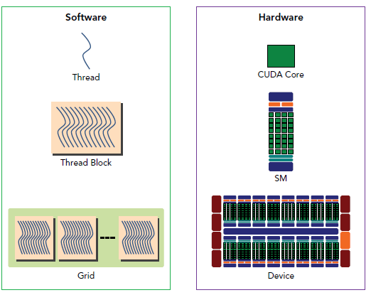

### GPU


####  基本概念

1. SM（Streaming Multiprocessors）是GPU架构中非常重要的部分，GPU硬件的并行性就是由SM决定的。

硬件和软件的映射关系如下图。一个SM可以有多个Thread Block,Thread Block中的线程在同一个SM.



2. CPU在GPU上启动内核（kernel），它是自己写的一段程序，在每个线程上运行.

```bash
一个kernel结构如下：Kernel<<<Dg, Db, Ns, S>>>(param1, param2, ...)

-Dg：grid的尺寸，说明一个grid含有多少个block，为dim3类型，一个grid最多含有65535*65535*65535个block，Dg.x，Dg.y，Dg.z最大值为65535；

-Db：block的尺寸，说明一个block含有多上个thread，为dim3类型，一个block最多含有1024(cuda2.x版本)个threads，Db.x和Db.y最大值为1024，Db.z最大值64；

（举个例子，一个block的尺寸可以是：1024*1*1 | 256*2*2 | 1*1024*1 | 2*8*64 | 4*4*64等）

-Ns：可选参数，如果kernel中由动态分配内存的shared memory，需要在此指定大小，以字节为单位；

-S：可选参数，表示该kernel处在哪个流当中。
```

3. warp是SM的基本执行单元。

一个warp包含32个并行thread，这32个thread执行于SIMT(Single Instruction Multiple Thread)模式。也就是说所有thread执行同一条指令，并且每个thread会使用各自的data执行该指令。

4. stream概念 Cuda stream是指一堆异步的cuda操作，他们按照host代码调用的顺序执行在device上。

cuda操作包括三个步骤（有先后顺序）：1. 将输入数据从host转移到device；2. 在device上执行kernel；3. 将结果从device上转移回host

5. event  Event是stream相关的一个重要概念，其用来标记strean执行过程的某个特定的点。其主要用途是：

同步stream执行
操控device运行步调


####  内存模型(todo)

pin memory适合操作小块数据，zero copy适合操作大块数据。

#### stream数据同步类型

Implicit Synchronization
Cuda有两种类型的host和device之间同步：显式和隐式。我们之前已经了解到显式同步API有：

cudaDeviceSynchronize
cudaStreamSynchronize
cudaEventSynchronize

Explicit Synchronization
从grid level来看显式同步方式，有如下几种：

Synchronizing the device
Synchronizing a stream
Synchronizing an event in a stream
Synchronizing across streams using an event


### 参考

1. [GPU架构](https://www.cnblogs.com/1024incn/p/4539754.html)
2. [warp解析](https://www.cnblogs.com/1024incn/p/4539754.html)
3. [cuda--memory model](https://www.cnblogs.com/1024incn/p/4564726.html)
4. [英伟达GPU架构演进近十年，从费米到安培](https://zhuanlan.zhihu.com/p/413145211)
5. [操作流程和kernel概念](https://www.cnblogs.com/hankeyyh/p/6580427.html)
6. [cuda stream和event](https://www.cnblogs.com/1024incn/p/5891051.html)