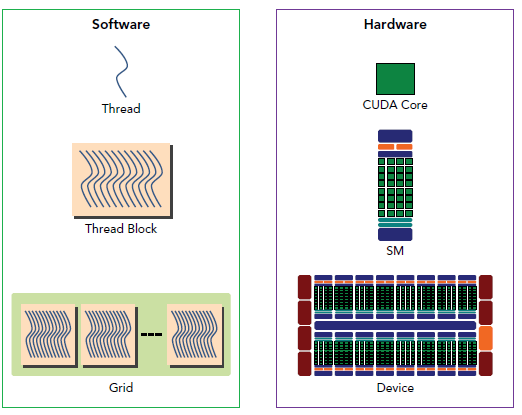

### GPU


####  基本概念

1. SM（Streaming Multiprocessors）是GPU架构中非常重要的部分，GPU硬件的并行性就是由SM决定的。

硬件和软件的映射关系如下图。一个SM可以有多个Thread Block,Thread Block中的线程在同一个SM.



2. CPU在GPU上启动内核（kernel），它是自己写的一段程序，在每个线程上运行.

```bash
一个kernel结构如下：Kernel<<<Dg, Db, Ns, S>>>(param1, param2, ...)

-Dg：grid的尺寸，说明一个grid含有多少个block，为dim3类型，一个grid最多含有65535*65535*65535个block，Dg.x，Dg.y，Dg.z最大值为65535；

-Db：block的尺寸，说明一个block含有多上个thread，为dim3类型，一个block最多含有1024(cuda2.x版本)个threads，Db.x和Db.y最大值为1024，Db.z最大值64；

（举个例子，一个block的尺寸可以是：1024*1*1 | 256*2*2 | 1*1024*1 | 2*8*64 | 4*4*64等）

-Ns：可选参数，如果kernel中由动态分配内存的shared memory，需要在此指定大小，以字节为单位；

-S：可选参数，表示该kernel处在哪个流当中。
```

3. warp是SM的基本执行单元。

一个warp包含32个并行thread，这32个thread执行于SIMT(Single Instruction Multiple Thread)模式。也就是说所有thread执行同一条指令，并且每个thread会使用各自的data执行该指令。

4. stream概念 Cuda stream是指一堆异步的cuda操作，他们按照host代码调用的顺序执行在device上。

cuda操作包括三个步骤（有先后顺序）：1. 将输入数据从host转移到device；2. 在device上执行kernel；3. 将结果从device上转移回host

5. event  Event是stream相关的一个重要概念，其用来标记strean执行过程的某个特定的点。其主要用途是：

同步stream执行
操控device运行步调


####  内存模型(todo)

pin memory适合操作小块数据，zero copy适合操作大块数据。

#### stream数据同步类型

Implicit Synchronization
Cuda有两种类型的host和device之间同步：显式和隐式。我们之前已经了解到显式同步API有：

cudaDeviceSynchronize
cudaStreamSynchronize
cudaEventSynchronize

Explicit Synchronization
从grid level来看显式同步方式，有如下几种：

Synchronizing the device
Synchronizing a stream
Synchronizing an event in a stream
Synchronizing across streams using an event


### 参考

1. [GPU架构](https://www.cnblogs.com/1024incn/p/4539754.html)
2. [warp解析](https://www.cnblogs.com/1024incn/p/4539754.html)
3. [cuda--memory model](https://www.cnblogs.com/1024incn/p/4564726.html)
4. [英伟达GPU架构演进近十年，从费米到安培](https://zhuanlan.zhihu.com/p/413145211)
5. [操作流程和kernel概念](https://www.cnblogs.com/hankeyyh/p/6580427.html)
6. [cuda stream和event](https://www.cnblogs.com/1024incn/p/5891051.html)
7. [深入GPU硬件架构及运行机制](https://www.cnblogs.com/timlly/p/11471507.html)


---

### 模型部署 & BEV感知 快速入门学习清单

> 目标：在 1 个下午（3-4小时）建立基础认知，能读懂模型从训练到推理全流程文档
---

#### 推荐学习顺序（按时间分配）
第1小时 → BEV基础概念
第2小时 → 模型量化基础
第3小时 → 重读目标文档（能看懂70%+）
第4小时 → 深入细节 / 问同事补充背景

---

#### 模块一：BEV 鸟瞰图感知（第1小时）
##### 学习目标
- 理解 PV（Perspective View, 透视视角）和 BEV（Bird's Eye View, 鸟瞰视角）的本质区别
- 知道相机图像如何转换到 BEV 空间
- 理解为什么自动驾驶更喜欢 BEV
##### 推荐资料（按顺序阅读）
1. 【知乎】BEV感知综述入门（中文，30min）
    - 搜索关键词：「BEV感知 自动驾驶 知乎」
    - 重点看：什么是 BEV、PV→BEV 转换原理、典型模型列表
        - 方向
            - 基于深度的方法（LSS法式为代表）
            - 基于transformer的方法，BEVFormer为代表
            - 基于MLP（multiple perception）的方法
            - 多模态融合阶段：以BEVFusion为代表的工作
2. 【论文精读】LSS（Lift, Splat, Shoot）核心思想（15min）
    - 不需要读全文，只看 Abstract + Introduction + 图示
    - 关键理解：相机图像通过深度估计"抬升"到3D空间，再"拍平"成BEV
3. 【视频】BEVFusion 讲解（可选，20min）
    - B站搜索：「BEVFusion 讲解」
    - 了解多模态（Camera + LiDAR）融合的思路
##### 核心结论（速记）
- PV：近大远小，细节好，但无法直接用于路径规划
- BEV：等比俯视，空间关系清晰，适合轨迹预测和规划
- RRRRRRR 双分支（NP导航 / LPNP停车场）都在 BEV 空间做特征融合
---

#### 模块二：模型量化基础（第2小时）
##### 学习目标
- 理解为什么要量化（性能 vs 精度权衡）
- 区分 FP32 / FP16 / INT8 的本质
- 理解 PTQ、QAT、QDQ 三个概念
- 知道各平台（NVIDIA/高通）量化差异的来源
    - 硬件架构差异：NV-GPU+ Tensor Core,高通-异构计算
    - 目标场景：NV-云端数据+高性能计算+自动驾驶，高通-移动端+边缘设备+物联网
    - 软件栈和工具链
    - 量化技术和精度支持：NV-精度支持广泛，高通-混合精度和强调低比特
    - 优化侧重点：NV-计算吞吐和内存带宽利用率，高通-最小化单次推理的能耗和延迟
##### 推荐资料（按顺序阅读）
4. 【文章】神经网络量化入门（中文，20min）参考[link](https://zhuanlan.zhihu.com/p/149659607)
    - 搜索关键词：「神经网络量化 INT8 原理 知乎」
    - 重点看：浮点→整数映射公式、对称 vs 非对称量化
    - 量化定义：类比浮点->整型（实际矩阵量化比这个要复杂）
5. 【官方文档】NVIDIA TensorRT 量化指南（英文，20min）
    - 网址：https://docs.nvidia.com/deeplearning/tensorrt/developer-guide/
    - 章节：INT8 Calibration 部分
    - 重点：校准数据集的作用、Entropy校准算法
6. 【白皮书】A White Paper on Neural Network Quantization（精读摘要，20min）（[link](https://arxiv.org/pdf/2106.08295)）
    - 搜索：「Qualcomm Neural Network Quantization White Paper」
    - 重点看摘要和图表，理解Per-channel vs Per-tensor量化差异

##### 核心概念速查表

| 概念 | 一句话解释 |
|------|-----------|
| FP32 | 32位浮点，训练默认格式，精度高，速度慢 |
| INT8 | 8位整数，推理常用，精度略损，速度快4倍 |
| PTQ(Post Training Quantization) | 训练后量化，用校准数据集确定量化参数 |
| QAT(Quantization-Aware Training) | 量化感知训练，训练时模拟量化，精度更高 |
| QDQ(Quantized-DeQuantized model) | 在ONNX图中插入Q/DQ节点，CPU上仿真INT8效果 |
| Per-channel | 每个卷积核单独量化，精度高（NVIDIA/高通都支持） |
| Per-tensor | 整层共用一组量化参数，精度略低，速度更快 |
| 对称量化 | 零点=0，NVIDIA常用 |
| 非对称量化 | 零点≠0，高通常用，更灵活 |

---

#### 模块三：ONNX 与推理优化（补充，30min）
##### 推荐资料
7. 【官网】ONNX 是什么 - https://onnx.ai/
    - 只看首页和 Getting Started，理解「硬件无关中间格式」概念
8. 【文章】从PyTorch到TensorRT部署全流程（中文，20min）[link](https://juejin.cn/post/7589935326782799906#heading-18)
    - 搜索：「PyTorch ONNX TensorRT 部署 知乎」
    - 对应文档中的：阶段2（导出）→ 阶段4（推理优化）
        - pytorch模型本身不支持TensorRT上部署，需要走如下流程：
PyTorch模型 → 导出ONNX中间模型（关键载体，解决跨框架兼容性） → 优化ONNX模型 → 转换为TensorRT引擎（.trt文件，最终部署文件）
---

#### 模块四：** 内部背景（问同事补充）
以下内容建议直接找团队同学了解，文档 / 网上资料较少：

- EBM / DDOBS / Motan / CameraOnemodel 各模块的业务含义
- NP（导航辅助驾驶）和 LPNP（停车场自动泊车）的产品背景
- RRRRRR → RRRRRRR 架构演进的动机（为什么要拆分 NP/LPNP 分支）
- BMC 推理芯片的基本情况（** 自研？外采？）
- 三阶段准出评测在实际项目中的流程和负责人
---

#### 学完后自测
读完上述资料后，尝试回答这些问题（能答出8成就达标）：

9. FP32模型转INT8量化，精度为什么会损失？如何减少损失？
    - FP32数据范围大，连续，高精度；INT8数据范围小，离线，低精度
    - 减少损失的手段：

10. 为什么高通 8650 用非对称量化，而 NVIDIA Orin 用对称量化？

11. QDQ模型的作用是什么？为什么不直接在板端验证？
QDQ模型是量化感知训练（QAT） 中的核心载体，它通过在训练图中插入"量化-反量化"节点对，来模拟真实的量化误差，从而让模型在训练阶段就提前适应低精度计算，最终在部署为INT8时获得更高的精度保持率。

##### QDQ模型的核心作用
1. 模拟量化过程，实现"感知"训练
    - 在QAT训练的前向传播中，QDQ节点会对FP32的权重和激活值执行 "量化 → 反量化" 操作。这相当于给数据添加了与真实量化一致的舍入噪声和截断误差，迫使模型权重在学习过程中调整，以抵抗这种噪声，从而对量化更鲁棒。
2. 显式标注量化边界与精度
    - 在ONNX计算图中，QDQ节点清晰地标明了哪些算子（如Conv、MatMul）应被转换为INT8计算。被QDQ节点包裹的算子，推理框架（如TensorRT）会将其处理为INT8算子；之外的则保持FP32。这提供了极精细的混合精度控制能力。
3. 存储并优化量化参数
    - QDQ节点内包含了尺度（scale） 和零点（zero_point） 这些关键量化参数。在QAT过程中，这些参数可以作为可训练变量，通过直通估计器（STE）进行学习更新，找到对模型精度最优的量化方案，这比训练后静态校准得到的参数更优。

**总结**：QDQ模型是QAT的实现载体和精度保障工具，它通过在训练图中模拟量化来提升最终INT8模型的精度。而"不在板端验证"是一种工程效率的必然选择，它将耗时的量化调优和精度验证放在资源丰富的开发端，板端只负责最终部署和确认，从而极大提升开发迭代速度，降低调试复杂度。

12. BEV特征和PV特征各有什么优劣势？RRRRRRR为什么选择BEV作为特征融合空间？
13. RRRRRRR比RRRRRR多了哪4个模型？架构上解决了什么问题？
---

#### 快速参考链接汇总
- ONNX 官网：https://onnx.ai
- TensorRT 文档：https://docs.nvidia.com/deeplearning/tensorrt/developer-guide/
- 高通 SNPE 文档：https://developer.qualcomm.com/software/qualcomm-neural-processing-sdk