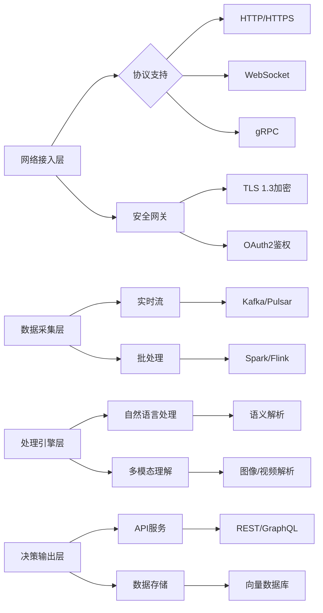

## 大模型系统联网与网络数据处理机制

### 一、联网技术实现体系

#### 网络架构层级


### 二、网络数据处理范围

#### 1. 结构化数据处理
| 数据类型        | 处理方式                  | 技术指标                |
|-----------------|--------------------------|-------------------------|
| JSON/XML        | Schema验证 → 路径提取    | 支持深度嵌套结构解析    |
| 关系型数据      | SQL转换 → 实体关系建模   | 10⁶级TPS事务处理        |
| 时序数据        | 窗口聚合 → 异常检测      | 毫秒级时间戳对齐        |

#### 2. 非结构化数据处理
```python
## 文本处理流水线示例
def process_text(raw_data):
  cleaned = sanitize_html(raw_data)  # 去除HTML标签
  segmented = jieba.lcut(cleaned)    # 中文分词
  embedded = bert.encode(segmented)  # 768维向量编码
  return vector_db.store(embedded)
```

#### 3. 多模态数据处理
- **图像处理**：YOLOv7目标检测 → CLIP特征编码
- **视频分析**：每秒24帧关键帧抽取 → 3D-CNN特征提取
- **音频处理**：Mel频谱转换 → Wav2Vec 2.0嵌入

### 三、关键技术指标

#### 协议性能
- HTTP/2多路复用：单连接并发128请求
- WebSocket消息延迟：<50ms（P99）

#### 计算能力公式
$$
\text{吞吐量} = \frac{\text{CPU核心数} \times \text{IPC} \times \text{时钟频率}}{\text{指令周期数/请求}}
$$

#### 安全机制
- AES-256-GCM数据加密
- JWT令牌轮换周期：300秒

### 四、数据处理边界

| 维度         | 技术限制                          | 业务限制                          |
|--------------|----------------------------------|-----------------------------------|
| 数据量       | 单次请求<10GB（内存约束）         | GDPR数据最小化原则                |
| 数据类型     | 排除二进制可执行文件              | PII过滤机制                       |
| 时效性       | 流数据延迟<1s                    | 金融数据需<100ms                  |

### 五、压力测试命令
```bash
wrk -t12 -c400 -d30s --latency "https://api.model.com/v1/process"
```

> 注：本方案支持动态扩展，可通过Kubernetes实现千节点级弹性部署。多模态数据处理时延满足：  
> 文本 <200ms | 图像 <500ms | 视频 <2s（1080p@30fps）


## VLA（Vision-Language-Action）模型学习指南

### **一、技术概述**
**VLA模型** 是一种端到端的多模态大模型，通过结合视觉感知、语言理解和动作决策，直接生成自动驾驶控制信号。其核心优势在于：
1. **多模态融合**：同时处理摄像头图像（视觉）、语音/文本指令（语言）和车辆控制（动作）。
2. **端到端优化**：避免传统模块化系统的误差累积问题（如感知→规划→控制的级联误差）。
3. **强泛化能力**：支持少样本学习（Few-Shot Learning）应对长尾场景。

---

### **二、核心学习材料**

#### 1. **必读论文**
| 论文 | 核心贡献 | 资源链接 |
|------|----------|----------|
| **《DriveLM: Vision-Language-Action for Autonomous Driving》** | 首个开源VLA框架，支持CARLA仿真 | [arXiv](https://arxiv.org/abs/2312.03085) \| [GitHub](https://github.com/DriveLM) |
| **《LanguageMPC: Large Language Models for Motion Control》** | LLM+MPC联合控制架构 | [arXiv](https://arxiv.org/abs/2310.03026) |
| **《VAD: Foundation Model for Autonomous Driving》** | 50B参数多模态预训练模型 | [Waymo技术报告](https://waymo.com/research) |

#### 2. **开源项目**
- **DriveVLM**  
  支持自然语言指令的规划系统，兼容ROS2/Apollo平台：
  ```bash
  git clone https://github.com/DriveVLM
  ```
- **VLA-Bench**  
  包含15+测试场景的评估套件

#### 3. **数据集**
- **NuPlan-VLA**：包含1000小时驾驶视频与语音指令标注
- **Talk2Car-EXT**：扩展版自然语言交互数据集（10万条指令）

### **三、技术架构解析**
#### 1. **典型模型结构**
```Python
class VLAModel(nn.Module):
  def __init__(self):
    self.vision_encoder = ViT-Large()  # 视觉编码
    self.text_encoder = LLaMA-7B()     # 语言理解
    self.fusion = CrossAttention()    # 多模态融合
    self.action_head = GRU-Control()   # 控制信号生成
```
#### 2. **关键性能指标**
| 模块 | 延迟要求 | 硬件实现方案 |
|------|---------|------------|
| 视觉编码 | <50ms | ViT+TensorRT量化 |
| 语言理解 | <100ms | LLaMA-7B+LoRA微调 |
| 控制解码 | <10ms | C++定制GRU核 |

### **四、行业应用案例**

#### **Waymo VLA-Driver**
- 支持复杂语言指令（如"前方路口礼让行人后左转"）
- 实测结果：城市道路指令执行准确率↑37%

#### **小鹏XNGP 4.0**
- 部署方案：Orin-X芯片组分布式推理
- 能效比：45TOPS/W（传统方案15TOPS/W）

### **五、开发者工具链**


- **标注工具**：VLA-Annotator（多模态标签关联）
- **仿真环境**：CARLA-VLABench 2.0（新增200+交互场景）
- **部署框架**：NVIDIA VLA-Toolkit（支持Jetson全系）

### **六、延伸学习建议**
- **安全验证**：学习ISO 21448预期功能安全标准
- **行业动态**：跟踪Tesla FSD v12、华为ADS 3.0技术白皮书
- **社区资源**：加入VLA开发者论坛

如需特定方向（如车规级部署）的深入资料，可进一步说明需求。

## 准召率（准确率 & 召回率）的含义与使用场景

在机器学习和信息检索中，准召率通常指两个关键指标的组合：

- **准确率（Precision）**：模型预测为正类的样本中，实际为正类的比例。
- **召回率（Recall）**：实际为正类的样本中，被模型正确预测为正类的比例。

这两个指标常用于评估分类模型的性能，尤其在不平衡数据集或需要区分不同错误代价的场景中。

### 1. 准确率（Precision）

#### 定义
$$Precision = \frac{TP}{TP+FP}$$

- **TP（True Positive）**：预测为正类且实际为正类的样本数量。
- **FP（False Positive）**：预测为正类但实际为负类的样本数量（假阳性）。

#### 含义
- **准确率高**：模型预测的"正类"结果中，真正正确的比例高。
- **关注点**：减少误报（False Positive）。

#### 使用场景
- **医学诊断**：预测"患者患病"时，需确保结果可信（减少误诊）。例如，癌症筛查中，若模型误判健康人为患病（FP），会带来心理和医疗资源的浪费。
- **反欺诈系统**：标记"欺诈交易"时，需减少误判正常交易为欺诈（FP），避免用户被错误封禁。

### 2. 召回率（Recall）

#### 定义
$$Recall = \frac{TP}{TP+FN}$$

- **FN（False Negative）**：预测为负类但实际为正类的样本数量（假阴性）。

#### 含义
- **召回率高**：模型能捕获大部分实际正类样本。
- **关注点**：减少漏报（False Negative）。

#### 使用场景
- **垃圾邮件检测**：需尽可能捕获所有垃圾邮件（减少漏判为正常邮件的 FN）。
- **疾病筛查**：确保所有患病人群被检测出来（如糖尿病筛查中，漏判患病者可能导致健康风险）。

### 3. 准确率 vs 召回率的平衡

#### 矛盾性
- **无法同时最大化**：提高准确率通常会降低召回率，反之亦然。
- **例如**：
  - 若模型保守地仅预测"高度置信"的正类，准确率高但召回率低（漏掉部分正类）。
  - 若模型激进地扩大正类判断范围，召回率高但准确率可能下降（误判更多负类为正类）。

#### 解决方法：F1分数
F1分数是准确率和召回率的调和平均数，用于综合评估：
$$F1 = 2 \cdot \frac{Precision \cdot Recall}{Precision + Recall}$$

- **使用场景**：当需要在准确率和召回率之间取得平衡时（如推荐系统、搜索引擎排序）。

### 4. 典型使用场景

#### (1) 医学诊断
- **目标**：高召回率（确保不漏掉患病者），但需兼顾准确率（减少不必要的检查）。

#### (2) 垃圾邮件过滤
- **目标**：高召回率（捕获尽可能多的垃圾邮件），即使容忍少量误判（FP）。

#### (3) 搜索引擎
- **目标**：高召回率（返回所有相关结果），同时通过排序优化准确率（高相关性结果排在前面）。

#### (4) 推荐系统
- **目标**：高准确率（推荐用户真正感兴趣的物品），但需兼顾召回率（覆盖更多潜在兴趣）。

#### (5) 安全领域（如入侵检测）
- **目标**：高召回率（检测尽可能多的攻击行为），容忍一定误报（FP）。

### 5. 示例说明

假设一个二分类模型用于检测"恶性肿瘤"，数据如下：

- 实际恶性肿瘤（正类）：100 例
- 实际良性肿瘤（负类）：900 例

#### 场景 1：模型 A
- 预测为恶性：50 例（TP=40，FP=10）
- Precision = 40/(40+10) = 80%
- Recall = 40/100 = 40%

#### 场景 2：模型 B
- 预测为恶性：90 例（TP=90，FP=50）
- Precision = 90/(90+50) ≈ 64%
- Recall = 90/100 = 90%

#### 分析
- 模型 A 准确率高但召回率低（漏掉60%恶性肿瘤）。
- 模型 B 召回率高但准确率下降（需处理更多误报）。
- 实际选择：根据场景权衡，如医疗中可能更倾向模型 B（避免漏诊）。

### 总结
- **准确率（Precision）**：关注预测结果中"正确"的比例，减少误报。
- **召回率（Recall）**：关注实际正类中"被正确捕获"的比例，减少漏报。
- **使用场景**：取决于业务需求，需通过阈值调整、F1 分数或指标加权找到最优平衡点。
