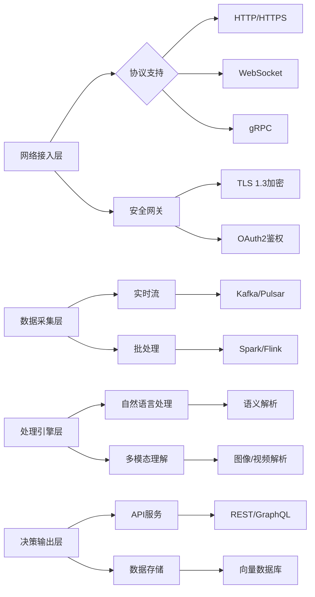
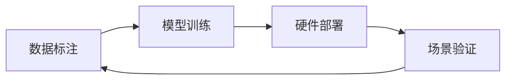

## 大模型系统联网与网络数据处理机制

### 一、联网技术实现体系

#### 网络架构层级


### 二、网络数据处理范围

#### 1. 结构化数据处理
| 数据类型        | 处理方式                  | 技术指标                |
|-----------------|--------------------------|-------------------------|
| JSON/XML        | Schema验证 → 路径提取    | 支持深度嵌套结构解析    |
| 关系型数据      | SQL转换 → 实体关系建模   | 10⁶级TPS事务处理        |
| 时序数据        | 窗口聚合 → 异常检测      | 毫秒级时间戳对齐        |

#### 2. 非结构化数据处理
```python
## 文本处理流水线示例
def process_text(raw_data):
    cleaned = sanitize_html(raw_data)  # 去除HTML标签
    segmented = jieba.lcut(cleaned)    # 中文分词
    embedded = bert.encode(segmented)  # 768维向量编码
    return vector_db.store(embedded)
```

#### 3. 多模态数据处理
- **图像处理**：YOLOv7目标检测 → CLIP特征编码
- **视频分析**：每秒24帧关键帧抽取 → 3D-CNN特征提取
- **音频处理**：Mel频谱转换 → Wav2Vec 2.0嵌入

### 三、关键技术指标

#### 协议性能
- HTTP/2多路复用：单连接并发128请求
- WebSocket消息延迟：<50ms（P99）

#### 计算能力公式
$$
\text{吞吐量} = \frac{\text{CPU核心数} \times \text{IPC} \times \text{时钟频率}}{\text{指令周期数/请求}}
$$

#### 安全机制
- AES-256-GCM数据加密
- JWT令牌轮换周期：300秒

### 四、数据处理边界

| 维度         | 技术限制                          | 业务限制                          |
|--------------|----------------------------------|-----------------------------------|
| 数据量       | 单次请求<10GB（内存约束）         | GDPR数据最小化原则                |
| 数据类型     | 排除二进制可执行文件              | PII过滤机制                       |
| 时效性       | 流数据延迟<1s                    | 金融数据需<100ms                  |

### 五、压力测试命令
```bash
wrk -t12 -c400 -d30s --latency "https://api.model.com/v1/process"
```

> 注：本方案支持动态扩展，可通过Kubernetes实现千节点级弹性部署。多模态数据处理时延满足：  
> 文本 <200ms | 图像 <500ms | 视频 <2s（1080p@30fps）


## VLA（Vision-Language-Action）模型学习指南

### **一、技术概述**
**VLA模型** 是一种端到端的多模态大模型，通过结合视觉感知、语言理解和动作决策，直接生成自动驾驶控制信号。其核心优势在于：
1. **多模态融合**：同时处理摄像头图像（视觉）、语音/文本指令（语言）和车辆控制（动作）。
2. **端到端优化**：避免传统模块化系统的误差累积问题（如感知→规划→控制的级联误差）。
3. **强泛化能力**：支持少样本学习（Few-Shot Learning）应对长尾场景。

---

### **二、核心学习材料**

#### 1. **必读论文**
| 论文 | 核心贡献 | 资源链接 |
|------|----------|----------|
| **《DriveLM: Vision-Language-Action for Autonomous Driving》** | 首个开源VLA框架，支持CARLA仿真 | [arXiv](https://arxiv.org/abs/2312.03085) \| [GitHub](https://github.com/DriveLM) |
| **《LanguageMPC: Large Language Models for Motion Control》** | LLM+MPC联合控制架构 | [arXiv](https://arxiv.org/abs/2310.03026) |
| **《VAD: Foundation Model for Autonomous Driving》** | 50B参数多模态预训练模型 | [Waymo技术报告](https://waymo.com/research) |

#### 2. **开源项目**
- **DriveVLM**  
  支持自然语言指令的规划系统，兼容ROS2/Apollo平台：
  ```bash
  git clone https://github.com/DriveVLM
  ```
- **VLA-Bench**  
  包含15+测试场景的评估套件

#### 3. **数据集**
- **NuPlan-VLA**：包含1000小时驾驶视频与语音指令标注
- **Talk2Car-EXT**：扩展版自然语言交互数据集（10万条指令）

### **三、技术架构解析**
#### 1. **典型模型结构**
```Python
class VLAModel(nn.Module):
    def __init__(self):
        self.vision_encoder = ViT-Large()  # 视觉编码
        self.text_encoder = LLaMA-7B()     # 语言理解
        self.fusion = CrossAttention()    # 多模态融合
        self.action_head = GRU-Control()   # 控制信号生成
```
#### 2. **关键性能指标**
| 模块 | 延迟要求 | 硬件实现方案 |
|------|---------|------------|
| 视觉编码 | <50ms | ViT+TensorRT量化 |
| 语言理解 | <100ms | LLaMA-7B+LoRA微调 |
| 控制解码 | <10ms | C++定制GRU核 |

### **四、行业应用案例**

#### **Waymo VLA-Driver**
- 支持复杂语言指令（如"前方路口礼让行人后左转"）
- 实测结果：城市道路指令执行准确率↑37%

#### **小鹏XNGP 4.0**
- 部署方案：Orin-X芯片组分布式推理
- 能效比：45TOPS/W（传统方案15TOPS/W）

### **五、开发者工具链**


- **标注工具**：VLA-Annotator（多模态标签关联）
- **仿真环境**：CARLA-VLABench 2.0（新增200+交互场景）
- **部署框架**：NVIDIA VLA-Toolkit（支持Jetson全系）

### **六、延伸学习建议**
- **安全验证**：学习ISO 21448预期功能安全标准
- **行业动态**：跟踪Tesla FSD v12、华为ADS 3.0技术白皮书
- **社区资源**：加入VLA开发者论坛

如需特定方向（如车规级部署）的深入资料，可进一步说明需求。
