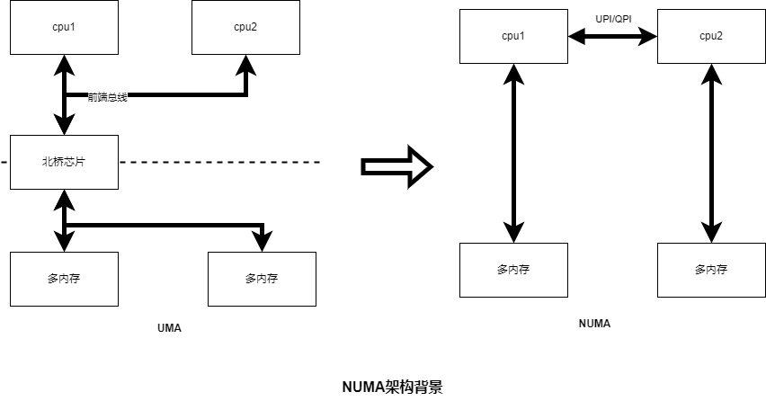

### 多线程

### ubuntu 18.04基本软件安装
```bash
[添加阿里云的源](https://blog.csdn.net/qq_44732146/article/details/121207737)
sudo apt install docker.io //docker
sudo apt install git
sudo apt-get install openssh-server && sudo /etc/init.d/ssh start
```
### ubuntu 安装gcc5.4后升级gcc5.5


```bash
sudo add-apt-repository ppa:ubuntu-toolchain-r/test -y && \
sudo apt-get update && \
sudo apt-get install gcc-5 g++-5
```

如果碰到apt_pkg module找不到，大概率是因为python配置的版本有问题，可以使用如下命令

```bash
cd /usr/lib/python3/dist-packages
sudo cp apt_pkg.cpython-35m-x86_64-linux-gnu.so apt_pkg.cpython-36m-x86_64-linux-gnu.so
```

### 查看cpu核数

```bash
lscpu
```
显示信息如下
[lscpu](../pic/doc/os/lscpu.png)

### numa和affinity


#### [numa介绍](https://zhuanlan.zhihu.com/p/336365600)

##### 背景



在 UMA 架构下，CPU 和内存之间的通信全部都要通过前端总线。而提高性能的方式，就是不断地提高 CPU、前端总线和内存的工作频率。

因为物理条件的限制，不断提高工作频率的路子走不下去了。CPU 性能的提升开始从提高主频转向增加 CPU 数量（多核、多 CPU）。越来越多的 CPU 对前端总线的争用，使前端总线成为了瓶颈。为了消除 UMA 架构的瓶颈，NUMA2（Non-Uniform Memory Access, 非一致性内存访问）架构诞生了.

CPU 厂商把内存控制器集成到 CPU 内部，一般一个 CPU socket 会有一个独立的内存控制器。
1. 每个 CPU scoket 独立连接到一部分内存，这部分 CPU 直连的内存称为“本地内存”。
2. CPU 之间通过 QPI（Quick Path Interconnect） 总线进行连接。CPU 可以通过 QPI 总线访问不和自己直连的“远程内存”。
3. 和 UMA 架构不同，在 NUMA 架构下，内存的访问出现了本地和远程的区别：访问远程内存的延时会明显高于访问本地内存。

###### 使用


Linux 有一个命令 numactl3 可以查看或设置 NUMA 信息。
1. numactl --hardware 查看硬件对numa的支持信息

```bash
# numactl --hardware
available: 2 nodes (0-1)
node 0 cpus: 0 1 2 3 4 5 6 7 8 9 10 11 12 13 14 15 16 17 18 19 20 21 22 23 48 49 50 51 52 53 54 55 56 57 58 59 60 61 62 63 64 65 66 67 68 69 70 71
node 0 size: 96920 MB
node 0 free: 2951 MB
node 1 cpus: 24 25 26 27 28 29 30 31 32 33 34 35 36 37 38 39 40 41 42 43 44 45 46 47 72 73 74 75 76 77 78 79 80 81 82 83 84 85 86 87 88 89 90 91 92 93 94 95
node 1 size: 98304 MB
node 1 free: 33 MB
node distances:
node   0   1 
  0:  10  21 
  1:  21  10
```


2. numactl --show 显示当前的 NUMA 设置
```bash
# numactl --show
policy: default
preferred node: current
physcpubind: 0 1 2 3 4 5 6 7 8 9 10 11 12 13 14 15 16 17 18 19 20 21 22 23 24 25 26 27 28 29 30 31 32 33 34 35 36 37 38 39 40 41 42 43 44 45 46 47 48 49 50 51 52 53 54 55 56 57 58 59 60 61 62 63 64 65 66 67 68 69 70 71 72 73 74 75 76 77 78 79 80 81 82 83 84 85 86 87 88 89 90 91 92 93 94 95 
cpubind: 0 1 
nodebind: 0 1 
membind: 0 1 
```

3. numactl 命令还有几个重要选项：
--cpubind=0： 绑定到 node 0 的 CPU 上执行。
--membind=1： 只在 node 1 上分配内存。
--interleave=nodes：nodes 可以是 all、N,N,N 或 N-N，表示在 nodes 上轮循（round robin）分配内存。
--physcpubind=cpus：cpus 是 /proc/cpuinfo 中的 processor（超线程） 字段，cpus 的格式与 --interleave=nodes 一样，表示绑定到 cpus 上运行。
--preferred=1： 优先考虑从 node 1 上分配内存。

例子参考
```bash
# 运行 test_program 程序，参数是 argument，绑定到 node 0 的 CPU 和 node 1 的内存
numactl --cpubind=0 --membind=1 test_program arguments

# 在 processor 0-4，8-12 上运行 test_program
numactl --physcpubind=0-4,8-12 test_program arguments

# 轮询分配内存
numactl --interleave=all test_program arguments

# 优先考虑从 node 1 上分配内存
numactl --preferred=1
```


#### [affinity介绍](https://en.wikipedia.org/wiki/Processor_affinity)

>Processor affinity, or CPU pinning or "cache affinity", enables the binding and unbinding of a process or a thread to a central processing unit (CPU) or a range of CPUs, so that the process or thread will execute only on the designated CPU or CPUs rather than any CPU. This can be viewed as a modification of the native central queue scheduling algorithm in a symmetric multiprocessing operating system. Each item in the queue has a tag indicating its kin processor. At the time of resource allocation, each task is allocated to its kin processor in preference to others.


[affinity使用](https://www.cnblogs.com/wenqiang/p/6049978.html)

CPU的亲和性， 就是进程要在指定的 CPU 上尽量长时间地运行而不被迁移到其他处理器，也称为CPU关联性；再简单的点的描述就将制定的进程或线程绑定到相应的cpu上；在多核运行的机器上，每个CPU本身自己会有缓存，缓存着进程使用的信息，而进程可能会被OS调度到其他CPU上，如此，CPU cache命中率就低了，当绑定CPU后，程序就会一直在指定的cpu跑，不会由操作系统调度到其他CPU上，性能有一定的提高。

1. 进程与cpu的绑定
> sched_set_affinity() （用来修改位掩码)

> sched_get_affinity() （用来查看当前的位掩码）


2. 线程与cpu的绑定

>   int pthread_setaffinity_np(pthread_t thread, size_t cpusetsize,
>                                   const cpu_set_t *cpuset);
>
>   int pthread_getaffinity_np(pthread_t thread, size_t cpusetsize,
>                                   cpu_set_t *cpuset);

### top 高级技能
之前被面试官问道过top的高级用法，比如为什么cpu利用率会达到> 100%（是累计的所有核cpu利用率）,blabla.我接下来罗列一些最近习得的技能。
#### Fields Management

比如查看进程运行在哪个核上，可以通过配置Fields Management（按f进入）中的P选项（空格选中），然后'q'退出后，就可以在top下看到P列（所在核数）的信息。

```bash
Tasks: 983 total,   1 running, 459 sleeping,   0 stopped,   0 zombie%Cpu(s):  1.0 us,  0.7 sy,  0.0 ni, 98.3 id,  0.0 wa,  0.0 hi,  0.0 si,  0.0 stKiB Mem : 52802470+total, 29371564+free, 12433692 used, 22187534+buff/cache
KiB Swap:        0 total,        0 free,        0 used. 52080150+avail Mem 
  PID USER      PR  NI    VIRT    RES    SHR S  %CPU %MEM     TIME+ COMMAND                                                                          P 
 3412 nobody    32  12  131928  42936   9880 S  89.3  0.0   1136:13 node_exporter                                                                   40 
```

#### h按键中的使用举例

- 按键1/2/3查看numa信息(todo列的信息解读)

```bash
top - 11:20:51 up 1 day, 20:28,  4 users,  load average: 0.30, 5.97, 15.91
Tasks: 983 total,   1 running, 462 sleeping,   0 stopped,   0 zombie
%Cpu0  :  1.6 us,  0.3 sy,  0.0 ni, 98.0 id,  0.0 wa,  0.0 hi,  0.0 si,  0.0 st
%Cpu1  :  1.6 us,  1.6 sy,  0.0 ni, 96.8 id,  0.0 wa,  0.0 hi,  0.0 si,  0.0 st
%Cpu2  :  1.0 us,  1.3 sy,  0.0 ni, 97.7 id,  0.0 wa,  0.0 hi,  0.0 si,  0.0 st

```

- 按键 V显示森林样式

```bash
top - 11:25:46 up 1 day, 20:32,  4 users,  load average: 5.58, 3.95, 12.20
Tasks: 990 total,   1 running, 459 sleeping,   0 stopped,   0 zombie
%Cpu(s):  0.8 us,  0.7 sy,  0.0 ni, 98.5 id,  0.0 wa,  0.0 hi,  0.0 si,  0.0 st
%Node0 :  0.7 us,  0.6 sy,  0.0 ni, 98.7 id,  0.0 wa,  0.0 hi,  0.0 si,  0.0 st
%Node1 :  0.8 us,  0.7 sy,  0.0 ni, 98.4 id,  0.0 wa,  0.0 hi,  0.0 si,  0.0 st
KiB Mem : 52802470+total, 29372800+free, 12429716 used, 22186699+buff/cache
KiB Swap:        0 total,        0 free,        0 used. 52080537+avail Mem 

  PID USER      PR  NI    VIRT    RES    SHR S  %CPU %MEM     TIME+ COMMAND
 2508 root      20   0   72304   6316   5568 S   0.0  0.0   0:00.05  `- sshd                                                                                                                                                                                                                          
 7586 root      20   0  106048   7280   6152 S   0.0  0.0   0:00.05      `- sshd                                                                                                                                                                                                                      
 7873 root      20   0   22032   5920   3652 S   0.0  0.0   0:00.20          `- bash                                                                                                                                                                                                                  
13094 root      20   0   11732   3248   2904 S   0.0  0.0   0:00.00              `- mtail.sh                                                                                                                                                                                                          
13863 root      20   0  720288  23412   9496 S   1.3  0.0   0:18.39                  `- mtail
```