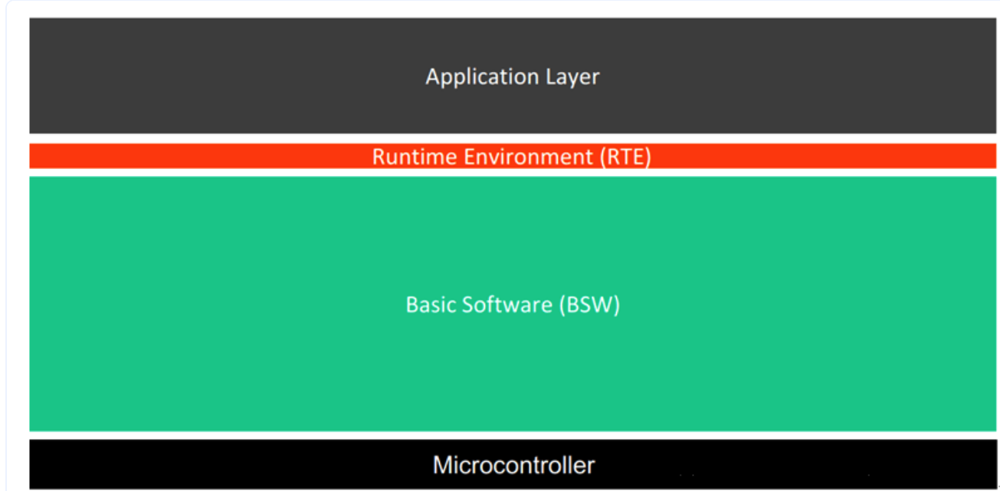

# Autosar架构

## AUTOSAR简介
AUTOSAR（Automotive Open System Architecture）是一个开放的汽车系统架构标准，旨在提高汽车电子系统的可重用性、可扩展性和互操作性。它提供了一套标准化的软件架构和接口，使得不同厂商的汽车电子系统能够更好地协同工作。
AUTOSAR的主要目标是支持汽车电子系统的模块化设计和开发，以便在不同车型和平台之间实现软件的重用。它还提供了一个统一的软件开发环境，使得汽车制造商和供应商能够更高效地进行协同开发。

### AUTOSAR CP的架构分为四个主要层次：
1. **应用层（Application Layer）**：包含汽车应用软件组件，这些组件实现了具体的功能，如动力系统控制、车身电子等。

2. **运行环境层（Runtime Environment,RTE）**:提供了应用层和基础软件层之间的接口，使得应用软件可以独立于底层硬件和基础软件进行开发。RTE负责管理应用组件之间的通信和数据交换。

3. **基础软件层（Basic Software Layer）**：提供了对硬件的抽象和访问，包括操作系统、通信协议、诊断服务等。它为应用层提供了必要的支持和服务。
4. **微控制器抽象层（Microcontroller Abstraction Layer）**：提供了对微控制器硬件的抽象，使得应用软件可以独立于具体的微控制器架构进行开发。

更详细的文档参考[AUTOSAR架构概述](https://modelbaba.com/architecture/autosar/1193.html)

### AUTOSAR AP的架构介绍
AP（Adaptive Platform）是AUTOSAR的一个重要组成部分，主要用于支持高性能计算和复杂应用的开发。AP架构采用了分层设计，主要包括以下几个层次：
1. **应用层（Application Layer）**：包含了高层次的应用软件组件，这些组件可以实现复杂的功能，如自动驾驶、车联网等。

2. **服务层（Service Layer）**：提供了一系列通用服务，如通信、数据存储、安全等，这些服务可以被应用层的组件调用。
3. **运行时环境层（Runtime Environment,RTE）**：类似于CP中的RTE，AP的RTE负责管理应用组件之间的通信和数据交换。
4. **基础软件层（Basic Software Layer）**：提供了对硬件的抽象和访问，包括操作系统、通信协议等。AP的基础软件层通常采用实时操作系统（RTOS）来支持高性能计算。

[万字长文解读AUTOSAR完整架构及AP特性](https://zhuanlan.zhihu.com/p/536367959)
## SOA

## DoIP

DoIP在传输层以下的规范遵循ISO 13400，而应用层还是遵循ISO 14229不变，这样可以保证UDS诊断在不同车载网络上的可移植性

> 参考
 1. [一文了解DoIP](https://blog.csdn.net/wjz110201/article/details/114940052#:~:text=%E5%92%8C%E5%A4%A7%E5%AE%B6%E6%8E%A2%E8%AE%A8%E3%80%82-,DoIP%E6%98%AFDiagnostic%20communication%20over%20Internet%20Protocol%20%E7%9A%84%E7%AE%80%E7%A7%B0%EF%BC%8C%E9%A1%BE%E5%90%8D%E6%80%9D%E4%B9%89,1%E8%BF%99%E5%9B%9B%E5%B1%82%E5%8D%8F%E8%AE%AE%E3%80%82)

## Some/IP(Scalable service-Oriented MiddlewarE over IP)
    
    主要用在ecu之间交换信息，底层协议使用udp/tcp.其报文格式如下图。

> 参考
1. 文档参考[autosar官网](https://www.autosar.org/search?tx_solr%5Bq%5D=someIp)
2. [汽车电子小白如何学习SOME/IP协议？](https://www.zhihu.com/question/535650389)

## AP Autosar介绍

ap 架构图

1. FO

2. Adaptive Autosar

3. Classic Autosar

## 开源的autosar 代码（todo）

> 参考

1. [一文看懂，Adaptive AUTOSAR从入门到精通（一）](http://www.uml.org.cn/qiyezjjs/202111054.asp)
2. [一文看懂，Adaptive AUTOSAR从入门到精通（一）](https://www.suncve.com/adaptive-autosar-from-introduction-to-mastery-2/)
3. [一文看懂，Adaptive AUTOSAR从入门到精通（三）](http://www.uml.org.cn/qiyezjjs/202111084.asp?artid=24618)

## DDS(Data Distribution Service)

dds 主要提供订阅和分发服务，其使用的传输协议有一下三种：
1.tcp 2.udp 3.shared-memory

> 参考

[Data Distribution Service (DDS) Community RTI Connext Users](https://community.rti.com/glossary-term/databus)
## TSN(gptp)

GPTP stands for "IEEE 802.1AS-Rev Time-Sensitive Networking (TSN) Protocol", also known as "IEEE 1588-2008 Precision Time Protocol (PTP) for G.MACs" or "gPTP" for short. It is a standard for time synchronization of clocks in distributed systems, particularly those that require precise timing, such as industrial automation, avionics, and multimedia applications.

## LIN总线
    Local Interconnect Network,类似uart总线，是基于 UART/SCI(通用异步收发器/串行通信接口)的低成本串行通信协议。

[LIN总线的学习](https://blog.csdn.net/zz56z56/article/details/95034165#:~:text=%E6%80%BB%E7%BA%BF%E7%9A%84%E5%AD%A6%E4%B9%A0-,LIN%E4%BB%8B%E7%BB%8DLIN%20%E6%98%AFLocal%20Interconnect%20Network%20%E7%9A%84%E7%BC%A9%E5%86%99%EF%BC%8C%E6%98%AF,%E5%BA%94%E7%94%A8%E9%83%BD%E4%BD%BF%E7%94%A8LIN%E6%80%BB%E7%BA%BF%E3%80%82)

### autosar文档基础

1. 在 AUTOSAR 标准文档中，"TR" 代表 Technical Report，通常是指补充或解释标准的技术性文件。与正式的 AUTOSAR 标准不同，TR 是建议性文件，只是为了更好地理解标准并提供实现建议。 TR 通常是由 AUTOSAR 的不同工作组或合作伙伴组织编写的，目的是提供更详细的指导，以帮助开发人员更好地实现标准。

2. 在 AUTOSAR 标准文档中，EXP 代表“Expected behavior”（预期行为）。在描述 AUTOSAR 软件组件、模块或接口时，通常会提供 EXP，以便用户了解其预期行为和使用方式。这有助于确保 AUTOSAR 软件在不同环境和组合中的兼容性和可靠性。

3. 在AUTOSAR标准文档中，TPS代表Technical Problem Statement（技术问题说明），它是一个技术性的问题描述，旨在描述存在的问题、原因和解决方案。在AUTOSAR开发中，当出现技术问题需要解决时，开发人员通常会首先创建一个TPS文件，详细说明问题所在以及解决方案。

4. RS：Requirement Specification，需求规范，RS主要是在Main、Methodology and Templates文件夹下，层次比SRS要高，比如AUTOSAR_RS_Main.pdf中对架构、基础软件、方法论等进行了明确的规范。

5. MMOD：Meta Mode，介绍AUTOSAR的元模型，AUTOSAR元模型是UML2.0模型。

6. SRS：Software Requirement Specification，软件需求规范，在software architecture/auxiliary下，用于对各个软件模块功能需求进行说明。比如COM模块，必须有I-PDU发送和接收功能、数据打包和解包的功能，无效信号检测功能等
> 参考

[gpt](https://chat.openai.com/c/52db85d8-2d9d-44e2-9bee-366b50d24b44)

[Autosar文档类别](https://zhuanlan.zhihu.com/p/136575633)