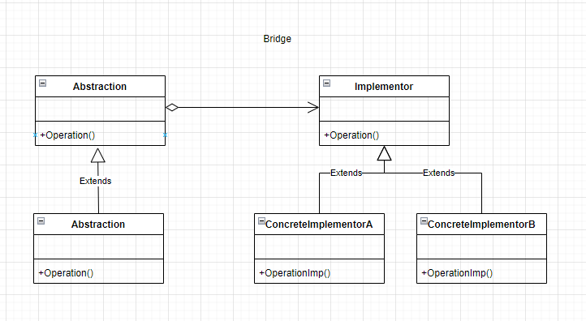

c++ version

### 设计模式的原则(todo)

[开放-封闭原则](https://www.cnblogs.com/gaochundong/p/open_closed_principle.html)

对于继承是开放的，对于修改是封闭的。

|abr|中文名字|全称|
|---|---|---|
|SRP|单一职责原则|Single Responsibility Principle｜
|OCP|开放封闭原则|Open Closed Principle|
|LSP|里氏替换原则|Liskov Substitution Principle|
|ISP|接口分离原则|Interface Segregation Principle|
|DIP|依赖倒置原则|Dependency Inversion Principle|
|LKP|最少知识原则|Least Knowledge Principle|

## 创建型模式

### singleton 单例模式

内部静态变量的懒汉单例模式，[代码](../c%2B%2B/singleton.cpp)
 
[单例模式](https://zhuanlan.zhihu.com/p/37469260)
[使用锁机制来保护](https://zhuanlan.zhihu.com/p/83539039)

### 简单工厂模式->工厂方法->模板工厂（todo）
[简单工厂](../c%2B%2B/simple_factor.cpp)->[工厂方法](../c%2B%2B/factor_method.cpp)->[模板工厂](../c%2B%2B/template_factory.cpp)

[深入浅出工厂模式](https://zhuanlan.zhihu.com/p/83535678)

以上方法扩展建立在开发－封闭原则基础上。

#### 工厂方法

工厂方法（Factory Method）又称虚拟构造函数(Virtual COnstructor)

1. 优缺点

|优点| 缺点|
|---|---|
|你可以避免创建者和具体产品之间的紧密耦合。|应用工厂方法模式需要引入许多新的子类， 代码可能会因此变得更复杂。 最好的情况是将该模式引入创建者类的现有层次结构中。|
|单一职责原则。 你可以将产品创建代码放在程序的单一位置， 从而使得代码更容易维护。||
|开闭原则。 无需更改现有客户端代码， 你就可以在程序中引入新的产品类型。||

2. uml图

3. 代码实现

4. 与其他模式的关系

### 原型模式

原型模式是一种创建型设计模式，使你能复制已有对象，而又无需使代码依赖它们所属的类。

1. 优缺点

|优点| 缺点|
|---|---|
|你可以克隆对象， 而无需与它们所属的具体类相耦合。| 克隆包含循环引用的复杂对象可能会非常麻烦。|
|你可以克隆预生成原型， 避免反复运行初始化代码。||
|你可以更方便地生成复杂对象。||
| 你可以用继承以外的方式来处理复杂对象的不同配置。||
2. uml图

3. 代码实现

[Clone](../c%2B%2B/design_pattern/Clone.cpp)

4. 与其他模式的关系

在许多设计工作的初期都会使用工厂方法模式 （较为简单， 而且可以更方便地通过子类进行定制）， 随后演化为使用抽象工厂模式、 原型模式或生成器模式 （更灵活但更加复杂）。

>參考

[原型模式](https://refactoringguru.cn/design-patterns/prototype)
[原型模式](https://zhuanlan.zhihu.com/p/365222623)

### 建造模式

建造模式又叫生成器（builder）模式

1. 优缺点

|优点| 缺点|
|---|---|
|你可以分步创建对象， 暂缓创建步骤或递归运行创建步骤。| 由于该模式需要新增多个类， 因此代码整体复杂程度会有所增加。|
|生成不同形式的产品时， 你可以复用相同的制造代码||
|单一职责原则。 你可以将复杂构造代码从产品的业务逻辑中分离出来。||

2. uml图

3. 代码实现

[Builder](../c%2B%2B/design_pattern/Builder.cpp)

4. 与其他模式的关系

在许多设计工作的初期都会使用工厂方法模式 （较为简单， 而且可以更方便地通过子类进行定制）， 随后演化为使用抽象工厂模式、 原型模式或生成器模式 （更灵活但更加复杂）。

生成器重点关注如何分步生成复杂对象。 抽象工厂专门用于生产一系列相关对象。 抽象工厂会马上返回产品， 生成器则允许你在获取产品前执行一些额外构造步骤。

你可以在创建复杂组合模式树时使用生成器， 因为这可使其构造步骤以递归的方式运行。

你可以结合使用生成器和桥接模式： 主管类负责抽象工作， 各种不同的生成器负责实现工作。

抽象工厂、 生成器和原型都可以用单例模式来实现。

>[builder](https://refactoringguru.cn/design-patterns/builder)

## 结构型模式

### 适配器模式

适配器（Adapter），也称封装器（Wrapper）

1. 优缺点

|优点| 缺点|
|---|---|
| 单一职责原则你可以将接口或数据转换代码从程序主要业务逻辑中分离。| 代码整体复杂度增加， 因为你需要新增一系列接口和类。 有时直接更改服务类使其与其他代码兼容会更简单。|
| 开闭原则。 只要客户端代码通过客户端接口与适配器进行交互， 你就能在不修改现有客户端代码的情况下在程序中添加新类型的适配器。||

2. uml图

3. 代码实现

[Adaptor](../c%2B%2B/design_pattern/Adaptor.cpp)

4. 与其他模式的关系

桥接模式通常会于开发前期进行设计， 使你能够将程序的各个部分独立开来以便开发。 另一方面， 适配器模式通常在已有程序中使用， 让相互不兼容的类能很好地合作。

适配器可以对已有对象的接口进行修改， 装饰模式则能在不改变对象接口的前提下强化对象功能。 此外， 装饰还支持递归组合， 适配器则无法实现。

适配器能为被封装对象提供不同的接口， 代理模式能为对象提供相同的接口， 装饰则能为对象提供加强的接口。

外观模式为现有对象定义了一个新接口， 适配器则会试图运用已有的接口。 适配器通常只封装一个对象， 外观通常会作用于整个对象子系统上。

桥接、 状态模式和策略模式 （在某种程度上包括适配器） 模式的接口非常相似。 实际上， 它们都基于组合模式——即将工作委派给其他对象， 不过也各自解决了不同的问题。 模式并不只是以特定方式组织代码的配方， 你还可以使用它们来和其他开发者讨论模式所解决的问题。

>[适配器模式](https://refactoringguru.cn/design-patterns/adapter)

### 代理模式

也称 Proxy,是一种结构型设计模式， 让你能够提供对象的替代品或其占位符。 代理控制着对于原对象的访问， 并允许在将请求提交给对象前后进行一些处理。

1. 优缺点

|优点| 缺点|
|---|---|
|你可以在客户端毫无察觉的情况下控制服务对象。| 代码可能会变得复杂， 因为需要新建许多类。|
| 如果客户端对服务对象的生命周期没有特殊要求， 你可以对生命周期进行管理。|服务响应可能会延迟。|
|即使服务对象还未准备好或不存在， 代理也可以正常工作。||
|开闭原则||

2. uml图

3. 代码实现

[Proxy](../c%2B%2B/design_pattern/Proxy.cpp)

4. 与其他模式的关系

适配器模式能为被封装对象提供不同的接口， 代理模式能为对象提供相同的接口， 装饰模式则能为对象提供加强的接口。

外观模式与代理的相似之处在于它们都缓存了一个复杂实体并自行对其进行初始化。 代理与其服务对象遵循同一接口， 使得自己和服务对象可以互换， 在这一点上它与外观不同。

装饰和代理有着相似的结构， 但是其意图却非常不同。 这两个模式的构建都基于组合原则， 也就是说一个对象应该将部分工作委派给另一个对象。 两者之间的不同之处在于代理通常自行管理其服务对象的生命周期， 而装饰的生成则总是由客户端进行控制。

>参考

[代理模式](https://refactoringguru.cn/design-patterns/proxy)

### 享元模式

1. 优缺点

|优点| 缺点|
|---|---|
| 如果程序中有很多相似对象， 那么你将可以节省大量内存。|你可能需要牺牲执行速度来换取内存， 因为他人每次调用享元方法时都需要重新计算部分情景数据。|
||代码会变得更加复杂。|

2. uml图

3. 代码实现，实现了预先分配内存的版本。根据需求创建元素的话，可以通过修改getFlyweight方法：添加判断逻辑，Flyweight中如果没有key，添加元素；如果有返回结果。

[Flyweight.cpp](../c%2B%2B/design_pattern/Flyweight.cpp)

>参考

[享元模式](https://refactoringguru.cn/design-patterns/flyweight)

### 组合模式

亦称对象树(Object Tree),Composite

1. 优缺点

|优点| 缺点|
|---|---|
| 你可以利用多态和递归机制更方便地使用复杂树结构| 对于功能差异较大的类， 提供公共接口或许会有困难。|
|开闭原则。||

2. uml图

3. 代码实现

[composite.cpp](../c%2B%2B/design_pattern/composite.cpp)

(todo)遍历访问的时候是倒置的树,需翻转180度。

4. 组合模式和桥接模式，状态模式，策略模式的接口非常相似。实际上，他们都是基于组合模式---即将工作委派给其他对象。

组合和责任链模式结合使用，可以将请求沿包含全体父组件的链一直传递到对象树的底部。
组合模式和迭代器模式来遍历组合树。
使用访问者模式对整个组合树来执行操作。
享元模式实现组合树的共享叶节点以节省内存。
组合和装饰模式的结构图很相似，两者都依赖递归组合来组织无限数量的对象。

>参考

[组合模式](https://refactoringguru.cn/design-patterns/composite)

### 桥接模式

桥接模式是一种结构型设计模式， 可将一个大类或一系列紧密相关的类拆分为抽象和实现两个独立的层次结构， 从而能在开发时分别使用。

1. 优缺点

|优点| 缺点|
|---|---|
| 你可以利用多态和递归机制更方便地使用复杂树结构|对高内聚的类使用该模式可能会让代码更加复杂|
|客户端代码仅与高层抽象部分进行互动， 不会接触到平台的详细信息。||
|开闭原则。 你可以新增抽象部分和实现部分， 且它们之间不会相互影响。||
| 单一职责原则。 抽象部分专注于处理高层逻辑， 实现部分处理平台细节。||

2. uml图

3. 代码实现

[Bridge](../c%2B%2B/design_pattern/Bridge.cpp)

4. 与其他模式的关系

桥接模式通常会于开发前期进行设计， 使你能够将程序的各个部分独立开来以便开发。 另一方面， 适配器模式通常在已有程序中使用， 让相互不兼容的类能很好地合作。

桥接、 状态模式和策略模式 （在某种程度上包括适配器） 模式的接口非常相似。 实际上， 它们都基于组合模式——即将工作委派给其他对象， 不过也各自解决了不同的问题。 模式并不只是以特定方式组织代码的配方， 你还可以使用它们来和其他开发者讨论模式所解决的问题

你可以将抽象工厂模式和桥接搭配使用。 如果由桥接定义的抽象只能与特定实现合作， 这一模式搭配就非常有用。 在这种情况下， 抽象工厂可以对这些关系进行封装， 并且对客户端代码隐藏其复杂性。

你可以结合使用生成器模式和桥接模式： 主管类负责抽象工作， 各种不同的生成器负责实现工作。

### 装饰模式

 装饰者模式(Decorator)、装饰器模式(Wrapper)

1. 优缺点

|优点| 缺点|
|---|---|
|你无需创建新子类即可扩展对象的行为。|在封装器栈中删除特定封装器比较困难。|
| 你可以在运行时添加或删除对象的功能。| 实现行为不受装饰栈顺序影响的装饰比较困难。|
| 你可以用多个装饰封装对象来组合几种行为。|各层的初始化配置代码看上去可能会很糟糕。|
| 单一职责原则。 你可以将实现了许多不同行为的一个大类拆分为多个较小的类。||

2. uml图

3. 代码实现

[Decorator](../c%2B%2B/design_pattern/Decorator.cpp)

4. 与其他模式的关系

### 外观模式

外观模式(Facade)是一种结构型设计模式， 能为程序库、 框架或其他复杂类提供一个简单的接口。

1. 优缺点

|优点| 缺点|
|---|---|
|你可以让自己的代码独立于复杂子系统。|外观可能成为与程序中所有类都耦合的上帝对象。|

2. uml图

3. 代码实现

[Facade](../c%2B%2B/design_pattern/Facade.cpp)

4. 与其他模式的关系

外观模式为现有对象定义了一个新接口， 适配器模式则会试图运用已有的接口。 适配器通常只封装一个对象， 外观通常会作用于整个对象子系统上。

当只需对客户端代码隐藏子系统创建对象的方式时， 你可以使用抽象工厂模式来代替外观。

享元模式展示了如何生成大量的小型对象， 外观则展示了如何用一个对象来代表整个子系统。

外观和中介者模式的职责类似： 它们都尝试在大量紧密耦合的类中组织起合作。

外观为子系统中的所有对象定义了一个简单接口， 但是它不提供任何新功能。 子系统本身不会意识到外观的存在。 子系统中的对象可以直接进行交流。
中介者将系统中组件的沟通行为中心化。 各组件只知道中介者对象， 无法直接相互交流。
外观类通常可以转换为单例模式类， 因为在大部分情况下一个外观对象就足够了。

外观与代理模式的相似之处在于它们都缓存了一个复杂实体并自行对其进行初始化。 代理与其服务对象遵循同一接口， 使得自己和服务对象可以互换， 在这一点上它与外观不同。

>[Facade](https://refactoringguru.cn/design-patterns/facade)

## 行为模式

### 中介模式

1. 优缺点

|优点| 缺点|
|---|---|
|单一职责|中介者可能会成为上帝都对像|
|开放-封闭原则||
|减轻多个组件之间的耦合||

2. uml图

3. 代码实现

[mediator.cpp](../c%2B%2B/design_pattern/mediator.cpp)

>参考

[C++ 中介者模式讲解和代码示例](https://refactoringguru.cn/design-patterns/mediator/cpp/example)

### 职责链模式

又称：责任链模式（Chain of Responsibility）、命令链（CoR，Chain of Command）

1. 优缺点

|优点| 缺点|
|---|---|
| 你可以控制请求处理的顺序。|部分请求可能未被处理。|
|单一职责原则。 你可对发起操作和执行操作的类进行解耦。||
|开闭原则。||

2. uml图

3. 代码实现

[chain_responsibility.cpp](../c%2B%2B/design_pattern/chain_responsibility.cpp)

>参考

[职责链模式](https://refactoringguru.cn/design-patterns/chain-of-responsibility)

### 状态模式

让你能在一个对象的内部状态变化时改变其行为， 使其看上去就像改变了自身所属的类一样。

1. 优缺点

|优点| 缺点|
|---|---|
| 单一职责原则。 将与特定状态相关的代码放在单独的类中|如果状态机只有很少的几个状态， 或者很少发生改变， 那么应用该模式可能会显得小题大作。|
|开闭原则。 无需修改已有状态类和上下文就能引入新状态。||
|通过消除臃肿的状态机条件语句简化上下文代码。||

2. uml图

3. 代码实现

[State](../c%2B%2B/design_pattern/State.cpp)

4. 与其他模式的关系

桥接模式、 状态模式和策略模式 （在某种程度上包括适配器模式） 模式的接口非常相似。 实际上， 它们都基于组合模式——即将工作委派给其他对象， 不过也各自解决了不同的问题。

状态可被视为策略的扩展。 两者都基于组合机制： 它们都通过将部分工作委派给 “帮手” 对象来改变其在不同情景下的行为。 策略使得这些对象相互之间完全独立， 它们不知道其他对象的存在。 但状态模式没有限制具体状态之间的依赖， 且允许它们自行改变在不同情景下的状态。

### 命令模式

也称动作(Action)，事务(Transaction)，命令（Command）

它可将请求转换为一个包含与请求相关的所有信息的独立对象。 该转换让你能根据不同的请求将方法参数化、 延迟请求执行或将其放入队列中， 且能实现可撤销操作。

1. 优缺点

|优点| 缺点|
|---|---|
|单一职责原则 |代码可能会变得更加复杂， 因为你在发送者和接收者之间增加了一个全新的层次。|
|开闭原则||
|可以实现撤销和恢复功能||
|可以操作的延迟执行||
|可以将一组简单命令组合成复杂命令||

2. uml图

3. 代码实现

[Command](../c%2B%2B/design_pattern/Command.cpp)

4. 与其他模式的关系

责任链按照顺序将请求动态传递给一系列的潜在接收者， 直至其中一名接收者对请求进行处理。

命令在发送者和请求者之间建立单向连接。

中介者清除了发送者和请求者之间的直接连接， 强制它们通过一个中介对象进行间接沟通。

观察者允许接收者动态地订阅或取消接收请求。

### 策略模式

也称Strategy，策略模式是一种行为设计模式， 它能让你定义一系列算法， 并将每种算法分别放入独立的类中， 以使算法的对象能够相互替换。

1. 优缺点

|优点| 缺点|
|---|---|
|你可以在运行时切换对象内的算法。| 如果你的算法极少发生改变， 那么没有任何理由引入新的类和接口。 使用该模式只会让程序过于复杂。|
| 你可以将算法的实现和使用算法的代码隔离开来。| 客户端必须知晓策略间的不同——它需要选择合适的策略。|
| 你可以使用组合来代替继承。| 许多现代编程语言支持函数类型功能， 允许你在一组匿名函数中实现不同版本的算法。 |
|开闭原则。 你无需对上下文进行修改就能够引入新的策略。||

2. uml图

3. 代码实现

[Strategy](../c%2B%2B/design_pattern/Strategy.cpp)

4. 与其他模式的关系

命令模式和策略看上去很像， 因为两者都能通过某些行为来参数化对象。 但是， 它们的意图有非常大的不同。

* 你可以使用命令来将任何操作转换为对象。 操作的参数将成为对象的成员变量。 你可以通过转换来延迟操作的执行、 将操作放入队列、 保存历史命令或者向远程服务发送命令等。

* 另一方面， 策略通常可用于描述完成某件事的不同方式， 让你能够在同一个上下文类中切换算法。

装饰模式可让你更改对象的外表， 策略则让你能够改变其本质。

模板方法模式基于继承机制： 它允许你通过扩展子类中的部分内容来改变部分算法。 策略基于组合机制： 你可以通过对相应行为提供不同的策略来改变对象的部分行为。 模板方法在类层次上运作， 因此它是静态的。 策略在对象层次上运作， 因此允许在运行时切换行为。

状态可被视为策略的扩展。 两者都基于组合机制： 它们都通过将部分工作委派给 “帮手” 对象来改变其在不同情景下的行为。 策略使得这些对象相互之间完全独立， 它们不知道其他对象的存在。 但状态模式没有限制具体状态之间的依赖， 且允许它们自行改变在不同情景下的状态。

### 模板方法模式（todo）

1. 优缺点

|优点| 缺点|
|---|---|
|||

2. uml图

(todo，少图)

3. 代码实现

[Template](../c%2B%2B/design_pattern/Template.cpp)

4. 与其他模式的关系

### 观察者模式

观察者模式（Observer）又称事件订阅者(Event-Subscriber)，监听者(Listener)

1. 优缺点

|优点| 缺点|
|---|---|
| 开闭原则。 你无需修改发布者代码就能引入新的订阅者类 （如果是发布者接口则可轻松引入发布者类）。|订阅者的通知顺序是随机的。|
|订阅者的通知顺序是随机的。||

2. uml图

3. 代码实现

[Observer](../c%2B%2B/design_pattern/Observer.cpp)

4. 与其他模式的关系

责任链模式、 命令模式、 中介者模式和观察者模式用于处理请求发送者和接收者之间的不同连接方式：

责任链按照顺序将请求动态传递给一系列的潜在接收者， 直至其中一名接收者对请求进行处理。
命令在发送者和请求者之间建立单向连接。
中介者清除了发送者和请求者之间的直接连接， 强制它们通过一个中介对象进行间接沟通。
观察者允许接收者动态地订阅或取消接收请求。
中介者和观察者之间的区别往往很难记住。 在大部分情况下， 你可以使用其中一种模式， 而有时可以同时使用。 让我们来看看如何做到这一点。

中介者的主要目标是消除一系列系统组件之间的相互依赖。 这些组件将依赖于同一个中介者对象。 观察者的目标是在对象之间建立动态的单向连接， 使得部分对象可作为其他对象的附属发挥作用。

有一种流行的中介者模式实现方式依赖于观察者。 中介者对象担当发布者的角色， 其他组件则作为订阅者， 可以订阅中介者的事件或取消订阅。 当中介者以这种方式实现时， 它可能看上去与观察者非常相似。

当你感到疑惑时， 记住可以采用其他方式来实现中介者。 例如， 你可永久性地将所有组件链接到同一个中介者对象。 这种实现方式和观察者并不相同， 但这仍是一种中介者模式。

假设有一个程序， 其所有的组件都变成了发布者， 它们之间可以相互建立动态连接。 这样程序中就没有中心化的中介者对象， 而只有一些分布式的观察者。

>[Observer](https://refactoringguru.cn/design-patterns/observer)

### 备忘录模式

备忘录(Memento)模式也称快照（snapshot）.允许在不暴露对象实现细节的情况下保存和恢复对象之前的状态。

1. 优缺点

|优点| 缺点|
|---|---|
|你可以在不破坏对象封装情况的前提下创建对象状态快照.|如果客户端过于频繁地创建备忘录， 程序将消耗大量内存。|
| 你可以通过让负责人维护原发器状态历史记录来简化原发器代码。|负责人必须完整跟踪原发器的生命周期， 这样才能销毁弃用的备忘录。|
||绝大部分动态编程语言 （例如 PHP、 Python 和 JavaScript） 不能确保备忘录中的状态不被修改。|

2. uml图

3. 代码实现

[Memento](../c%2B%2B/design_pattern/Memento.cpp)

4. 与其他模式的关系

你可以同时使用命令模式和备忘录模式来实现 “撤销”。 在这种情况下， 命令用于对目标对象执行各种不同的操作， 备忘录用来保存一条命令执行前该对象的状态。

你可以同时使用备忘录和迭代器模式来获取当前迭代器的状态， 并且在需要的时候进行回滚。

有时候原型模式可以作为备忘录的一个简化版本， 其条件是你需要在历史记录中存储的对象的状态比较简单， 不需要链接其他外部资源， 或者链接可以方便地重建。

>[Memento](https://refactoringguru.cn/design-patterns/memento)

### 迭代器模式（看不懂设计模式的代码和网上的示例代码,todo）

1. 优缺点

|优点| 缺点|
|---|---|
|||

2. uml图

3. 代码实现

4. 与其他模式的关系

### 访问者模式（todo）

1. 优缺点

|优点| 缺点|
|---|---|
|||

2. uml图

3. 代码实现

4. 与其他模式的关系

### 解释器模式（todo）

1. 优缺点

|优点| 缺点|
|---|---|
|||

2. uml图

3. 代码实现

[Interpreter](../c%2B%2B/design_pattern/Interpreter.cpp)

4. 与其他模式的关系

