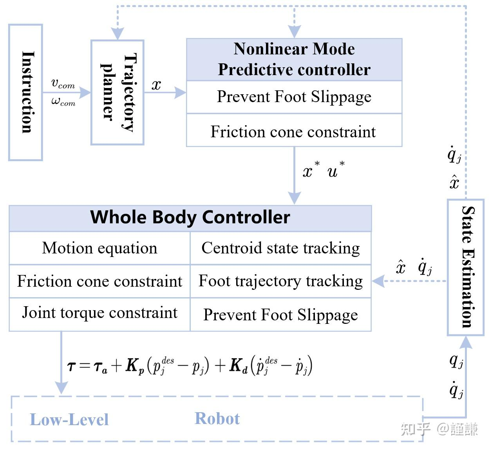
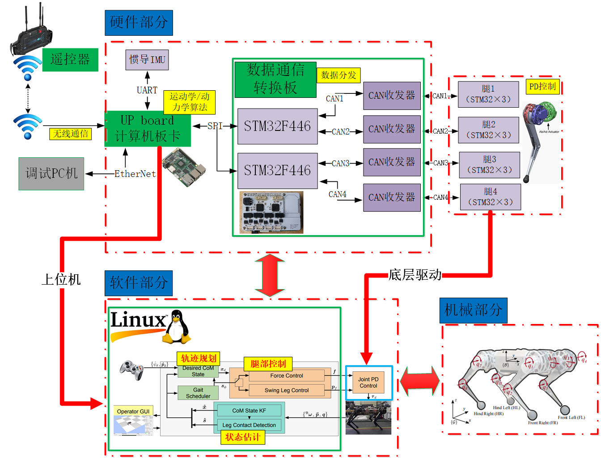

<!-- TOC -->

- [面试](#%E9%9D%A2%E8%AF%95)
    - [arm准备](#arm%E5%87%86%E5%A4%87)
    - [enflame总结](#enflame%E6%80%BB%E7%BB%93)
    - [小米总结](#%E5%B0%8F%E7%B1%B3%E6%80%BB%E7%BB%93)
            - [QoS in DDS](#qos-in-dds)
            - [p3server,p2servertodo](#p3serverp2servertodo)
            - [backtrace,tasking编译器编c++todo](#backtracetasking%E7%BC%96%E8%AF%91%E5%99%A8%E7%BC%96ctodo)
    - [小鹏汽车总结](#%E5%B0%8F%E9%B9%8F%E6%B1%BD%E8%BD%A6%E6%80%BB%E7%BB%93)
    - [博世准备](#%E5%8D%9A%E4%B8%96%E5%87%86%E5%A4%87)
    - [技术总结](#%E6%8A%80%E6%9C%AF%E6%80%BB%E7%BB%93)
            - [RDMA 和 DPDK对比](#rdma-%E5%92%8C-dpdk%E5%AF%B9%E6%AF%94)
            - [SPDK的核心](#spdk%E7%9A%84%E6%A0%B8%E5%BF%83)
        - [android system/core路径下有如下数据（chatgpt answer）](#android-systemcore%E8%B7%AF%E5%BE%84%E4%B8%8B%E6%9C%89%E5%A6%82%E4%B8%8B%E6%95%B0%E6%8D%AEchatgpt-answer)
        - [分布式面经todo](#%E5%88%86%E5%B8%83%E5%BC%8F%E9%9D%A2%E7%BB%8Ftodo)
    - [沐曦科技准备](#%E6%B2%90%E6%9B%A6%E7%A7%91%E6%8A%80%E5%87%86%E5%A4%87)
            - [system c](#system-c)
            - [参考](#%E5%8F%82%E8%80%83)
        - [参考](#%E5%8F%82%E8%80%83)
        - [MQTT](#mqtt)
- [frp服务器配置](#frp%E6%9C%8D%E5%8A%A1%E5%99%A8%E9%85%8D%E7%BD%AE)
- [字符编码](#%E5%AD%97%E7%AC%A6%E7%BC%96%E7%A0%81)
- [识别表格中的指定颜色数量](#%E8%AF%86%E5%88%AB%E8%A1%A8%E6%A0%BC%E4%B8%AD%E7%9A%84%E6%8C%87%E5%AE%9A%E9%A2%9C%E8%89%B2%E6%95%B0%E9%87%8F)
        - [方法一：使用VBA宏](#%E6%96%B9%E6%B3%95%E4%B8%80%E4%BD%BF%E7%94%A8vba%E5%AE%8F)
- [Vim 快捷键速查表](#vim-%E5%BF%AB%E6%8D%B7%E9%94%AE%E9%80%9F%E6%9F%A5%E8%A1%A8)
    - [基本操作](#%E5%9F%BA%E6%9C%AC%E6%93%8D%E4%BD%9C)
    - [方向键](#%E6%96%B9%E5%90%91%E9%94%AE)
    - [浏览文档](#%E6%B5%8F%E8%A7%88%E6%96%87%E6%A1%A3)
    - [插入文本](#%E6%8F%92%E5%85%A5%E6%96%87%E6%9C%AC)
    - [特殊插入](#%E7%89%B9%E6%AE%8A%E6%8F%92%E5%85%A5)
    - [删除文本](#%E5%88%A0%E9%99%A4%E6%96%87%E6%9C%AC)
    - [简单替换文本](#%E7%AE%80%E5%8D%95%E6%9B%BF%E6%8D%A2%E6%96%87%E6%9C%AC)
    - [复制/粘贴文本](#%E5%A4%8D%E5%88%B6%E7%B2%98%E8%B4%B4%E6%96%87%E6%9C%AC)
    - [撤销/重做操作](#%E6%92%A4%E9%94%80%E9%87%8D%E5%81%9A%E6%93%8D%E4%BD%9C)
    - [搜索和替换](#%E6%90%9C%E7%B4%A2%E5%92%8C%E6%9B%BF%E6%8D%A2)
    - [书签](#%E4%B9%A6%E7%AD%BE)
    - [选择文本](#%E9%80%89%E6%8B%A9%E6%96%87%E6%9C%AC)
    - [改动选中文本](#%E6%94%B9%E5%8A%A8%E9%80%89%E4%B8%AD%E6%96%87%E6%9C%AC)
    - [保存并退出](#%E4%BF%9D%E5%AD%98%E5%B9%B6%E9%80%80%E5%87%BA)
        - [下载 Vim 快捷键速查表](#%E4%B8%8B%E8%BD%BD-vim-%E5%BF%AB%E6%8D%B7%E9%94%AE%E9%80%9F%E6%9F%A5%E8%A1%A8)
- [markdown中添加大纲](#markdown%E4%B8%AD%E6%B7%BB%E5%8A%A0%E5%A4%A7%E7%BA%B2)
        - [使用 [TOC] 标签](#%E4%BD%BF%E7%94%A8-toc-%E6%A0%87%E7%AD%BE)
        - [使用 doctoc](#%E4%BD%BF%E7%94%A8-doctoc)
        - [使用 markdown-toc](#%E4%BD%BF%E7%94%A8-markdown-toc)
        - [VSCode 插件](#vscode-%E6%8F%92%E4%BB%B6)
        - [总结](#%E6%80%BB%E7%BB%93)

<!-- /TOC -->
# 面试

## arm准备

1. 相关硬件的深入（todo）

cxl(compute express link)

dpdk:data plane develop kit

spdk:storage performance develop kit.

numa(non unify memroy access)   I/O network

aarch64是64位执行状态，包括状态的异常模型、内存模型、程序员模型和指令集支持

2. arm mali gpu

3. Vulkan,OpenGL/ES,EGL.

Vulkan is next generation of OpenGL.

Direct3D is a graphics application programming interface (API) for Microsoft Windows.

WebGL (Web Graphics Library) is a JavaScript API for rendering high-performance interactive 3D and 2D graphics within any compatible web browser without the use of plug-ins. WebGL does so by introducing an API that closely conforms to OpenGL ES 2.0 that can be used in HTML <canvas> elements.

[shadertoy教程](https://vosaica.github.io/2020/08/07/Shadertoy_vol1/)

## enflame总结

1. horovod总结

[深度学习分布式训练框架 Horovod](https://www.cnblogs.com/rossiXYZ/p/14856464.html)

2. pytorch源码分析

3. shell 脚本基本语法

4. tensorflow2/PalMe 2算法原理（端到端训练）

5. 性能调优的方向CPU/文件io/内存/网络

cpu工具：top

文件io工具：iostat

内存工具：vmstat

网络io工具：sar

实际项目上使用的优化技巧：数据预取，设置cpu的affinity,合并tensorflow/pytorch的stream。


[分布式-性能调优](https://zhuanlan.zhihu.com/p/397896543)

## 小米总结

#### QoS in DDS
QoS, or Quality of Service, is a set of parameters that control the behavior of a DDS system. These parameters can be used to control the reliability, liveliness, durability, and other aspects of the system. Some qos example as below

```bash
// Create a QosPolicy for the DataWriter.
dds.DataWriterQos qos = new dds.DataWriterQos();

// Set the reliability to reliable.
qos.reliability.kind = dds.ReliabilityQosPolicyKind.Reliable;

// Set the liveliness to automatic.
qos.liveliness.kind = dds.LivelinessQosPolicyKind.Automatic;

// Set the durability to transient local.
qos.durability.kind = dds.DurabilityQosPolicyKind.TransientLocal;

// Set the history to unlimited.
qos.history.kind = dds.HistoryQosPolicyKind.KeepLast;

// Set the history depth to 100.
qos.history.depth = 100;

// Set the latency budget to 100 milliseconds.
qos.latency_budget = 100;

// Set the ownership to exclusive.
qos.ownership.kind = dds.OwnershipQosPolicyKind.Exclusive;

// Set the access control to allow all readers.
qos.access_control.kind = dds.AccessDecisionKind.AllowAll;

// Create a QosProfile for the DataWriter.
dds.QosProfile profile = new dds.QosProfile();

// Add the QosPolicy to the QosProfile.
profile.add("DataWriterQos", qos);

// Set the QosProfile for the DataWriter.
writer.qos = profile;

```

[soc和mcu之间通信方式](https://zhuanlan.zhihu.com/p/599146849)：uart->spi->ethernet 
[自动驾驶系统性能优化](https://zhuanlan.zhihu.com/p/63125847)
aurix平台(TC397)(todo)


#### p3server,p2server(todo)

#### backtrace,tasking编译器编c++(todo)

[backtrace调试程序段错误](https://blog.csdn.net/u011298001/article/details/84400991)

## 小鹏汽车总结


## 博世准备

粒子滤波，卡尔曼滤波，贝叶斯理论(todo) 参考bili上老王课程

## 技术总结
#### RDMA 和 DPDK对比

相同点：

1）两者均为kernel bypass技术，可以减少中断次数，消除内核态到用户态的内存拷贝；

相异点：

1）DPDK是将协议栈上移到用户态，而RDMA是将协议栈下沉到网卡硬件，DPDK仍然会消耗CPU资源；

2）DPDK的并发度取决于CPU核数，而RDMA的收包速率完全取决于网卡的硬件转发能力

3）DPDK在低负荷场景下会造成CPU的无谓空转，RDMA不存在此问题

4）DPDK用户可获得协议栈的控制权，可自主定制协议栈；RDMA则无法定制协议栈

#### SPDK的核心

SPDK 重用了 DPDK 中的一些公共组件，比如内存管理、轮询方式的实现等。SPDK的核心是通过无锁、轮询的方式实现高效的用户态驱动集合：

1. SPDK 将 NVMe 协议的实现放在用户态，存储应用程序直接通过 SPDK 提供的 API 访问设备，不需要 Linux 内核提供的驱动支持。
2. SPDK 一个重要的设计理念是无锁化，这样避免了多线程由于对锁的争抢而引入的性能开销。
3. 轮询模式，SPDK 使用轮询方式处理数据，这样避免了传统中断方式由于上下文切换而引入的性能开销

### android system/core路径下有如下数据（chatgpt answer）

The /system/core directory in the Linux kernel source tree contains various core components of the Android operating system, including:

1. init: This directory contains the source code for the init process, which is the first process that is started when the Android system boots up. The init process is responsible for starting all other processes and services.

2. liblog: This directory contains the source code for the Android logging system, which is used to log events and messages generated by the system and applications.

3. libutils: This directory contains various utility classes and functions that are used throughout the Android system.

4. libcutils: This directory contains utility functions for working with files, strings, and other common data types.

5. debuggerd: This directory contains the source code for the debugger daemon, which is responsible for collecting and reporting crash dumps when a process crashes.

6. logcat: This directory contains the source code for the logcat command-line tool, which is used to view and filter system and application logs.

7. toolbox: This directory contains various command-line tools that are used in the Android system, such as adb, am, and pm.

8. include: This directory contains header files that are used throughout the Android system, including kernel headers and headers for various system libraries.

Overall, the /system/core directory contains essential components of the Android system that are necessary for the system to function properly.

### 分布式面经(todo)

[分布式面经1](https://www.jianshu.com/p/182fe2d1946e)


## 沐曦科技准备

#### system c

asic设计流程:

需求->顶层架构设计->芯片建模->逻辑设计 和 功能仿真->物理设计


c model 的功能定位：

1. 作为算法模型的C版本，定义模块输入输出行为的标准，实现数据的bit-match；

2. 在1的基础上，定义模块的内部结构和资源约束；

3. 在2的基础上，精确定义模块的输入输出时序，实现cycle-accurate；

c model的设计流程：

1. 解决基础的数学运算问题，比如整数、定点数、点数、指数、三角函数运算

2. 定义模块的内部结构和资源约束

3. cycle-accurate基别的仿真

#### 参考

[ASIC Design and C Model](https://zhuanlan.zhihu.com/p/263012865)

### 参考

1. [spdk](https://github.com/spdk/spdk)
2. [dpdk](https://github.com/DPDK/dpdk)
3. [全网【DPDK/SPDK】技术视频教程：SPDK 存储性能开发套件](https://www.bilibili.com/video/BV1ZD4y1r7qW/?spm_id_from=333.337.search-card.all.click&vd_source=bce36a62109c7c14e5d27e3a9df82a18)
4. [RDMA vs. DPDK](https://www.jianshu.com/p/09b4b756b833)
5. [使用 SPDK 技术优化虚拟机本地存储的 IO 性能](https://blog.didiyun.com/index.php/2018/12/20/spdk-io/)
6. [好大一棵树 - PCIe Tree](https://mp.weixin.qq.com/s?__biz=MzU4MTczMDg1Nw==&mid=2247483660&idx=1&sn=c3f0da07f82685a1c09f176efb4fb695&chksm=fd42564aca35df5c358f3744cb784d6af8ee2993fa5a740eaeb44c3579e3f0c62d217e753477&scene=178&cur_album_id=1337043626001661952#rd)


### MQTT
基于tcp/ip的一个协议，qos有0，1，2三种。

>参考[知乎mqtt协议，终于有人讲清楚了](https://zhuanlan.zhihu.com/p/421109780)


# frp服务器配置

[FRP搭建内网穿透(亲测有效)](https://blog.csdn.net/qq_36981760/article/details/115713179)
[Ubuntu下实现Frpc自启动](https://zhuanlan.zhihu.com/p/521448626)

# 字符编码
字符编码是计算机中用于存储和传输文本信息的系统，它将字符集合映射到了一组可以通过计算机处理的数值上。下面列举了一些常见的字符编码：

ASCII (American Standard Code for Information Interchange)

最初设计用于表示英语字符，使用7位二进制数来表示128个不同的符号，包括大小写英文字母、数字和一些控制字符。
ISO-8859 系列

一组单字节字符编码，扩展了 ASCII 编码，以包括其他西欧语言的字符。
UTF-8 (Unicode Transformation Format – 8-bit)

一种针对Unicode的可变长度字符编码，能够表示世界上几乎所有的字符，并且与 ASCII 兼容。
UTF-16

另一种针对 Unicode 的字符编码，使用2个字节或者4个字节表示每个字符，比 UTF-8 使用更多的存储空间，但在某些应用场景下效率更高。
UTF-32

也是 Unicode 字符集的编码方式之一，每个Unicode字符都使用固定的4个字节来表示。
GB2312

中国大陆最早的简体中文字符集和字符编码标准，使用双字节表示一个汉字。
GBK

扩展了 GB2312，增加了很多汉字和符号。
GB18030

是中国大陆现行的官方字符集标准，向下兼容 GB2312 和 GBK，并且扩展以包含几乎所有Unicode字符。
Big5

主要用于繁体中文环境，如台湾和香港地区，使用双字节表示一个汉字。
EUC (Extended Unix Code)

主要用于日本语、中文（简体和繁体）和韩语等字符的编码。
Shift JIS

日本的一种字符编码方式，适用于日文。
这些只是众多字符编码中的一部分，存在着其他许多专门为特定语言或用途设计的字符编码。随着时间的发展，全球化和互联网的普及使得基于 Unicode 标准的编码（如 UTF-8、UTF-16、UTF-32）变得更加流���，因为它们致力于支持全世界所有语言的字符表述。

# 识别表格中的指定颜色数量

在Excel中统计某种颜色的单元格数量通常不能直接用内置函数完成，但可以通过使用VBA宏或条件格式配合辅助功能来实现。以下是两种方法：

### 方法一：使用VBA宏

1. 按 `Alt + F11` 打开VBA编辑器。
2. 选择 `插入` > `模块` 来创建一个新的模块。
3. 在模块窗口中粘贴以下代码：
    ```vba
    Function CountColorCells(rData As Range, cellRefColor As Range) As Long
        Dim count As Long
        Dim dataCell As Range
        
        Application.Volatile
        count = 0
        
        For Each dataCell In rData
            If dataCell.Interior.Color = cellRefColor.Interior.Color Then
                count = count + 1
            End If
        Next dataCell
        
        CountColorCells = count
    End Function
    ```
4. 关闭VBA编辑器并返回到Excel工作表。
5. 在一个单元格里输入公式 `=CountColorCells(范围, 参考单元格)`。其中“范围”是你想要统计颜色的单元格区域，“参考单元格”是具有你想要统计的颜色的单元格。

例如，如果你想统计A1:A10这个范围内所有与B1单元格颜色相同的单元格的数量，那么你可以使用这样的公式：
```
=CountColorCells(A1:A10, B1)
```

# Vim 快捷键速查表

**作者**： Himanshu Arora  
**译者**： LCTT Martin♡Adele  
**日期**： 2017-01-25

---

本文是 Vim 用户指南 系列的其中一篇：

- Vim 初学者入门指南
- Vim 快捷键速查表
- 5 个针对有经验用户的 Vim 技巧
- 3 个针对高级用户的 Vim 编辑器实用技巧

Vim 编辑器是一个基于命令行的工具，是传奇编辑器 vi 的增强版。尽管图形界面的富文本编辑有很多，但是熟悉 Vim 对于每一位 Linux 的使用者都能有所帮助——无论你是经验丰富的系统管理员，还是刚上手树莓派的新手用户。

这个轻量级的编辑器是个非常强大的工具。在有经验的使用者手中，它能完成不可思议的任务。除了常规的文本编辑功能以外，它还支持一些进阶特性。例如，基于正则表达式的搜索和替换、编码转换，以及语法高亮、代码折叠等的编程特性。

使用 Vim 时有一个非常重要的一点需要注意，那就是按键的功能取决于编辑器当前的“模式”。例如，在“普通模式”输入字母 `j` 时，光标会向下移动一行。而当你在“插入模式”下输入字符，则只是正常的文字录入。

下面就是速查表，以便于你充分利用 Vim。

## 基本操作

| 快捷键 | 功能 |
|--------|------|
| `Esc`  | 从当前模式转换到“普通模式”。所有的键对应到命令。 |
| `i`    | “插入模式”用于插入文字。回归按键的本职工作。 |
| `:`    | “命令行模式” Vim 希望你输入类似于保存该文档命令的地方。 |

## 方向键

| 快捷键          | 功能                       |
|-----------------|----------------------------|
| `h`             | 光标向左移动一个字符       |
| `j` 或 `Ctrl + J` | 光标向下移动一行         |
| `k` 或 `Ctrl + P` | 光标向上移动一行         |
| `l`             | 光标向右移动一个字符       |
| `0`             | 移动光标至本行开头        |
| `$`             | 移动光标至本行末尾        |
| `^`             | 移动光标至本行第一个非空字符处 |
| `w`             | 向前移动一个词            |
| `W`             | 向前移动一个词            |
| `5w`            | 向前移动五个词           |
| `b`             | 向后移动一个词            |
| `B`             | 向后移动一个词            |
| `5b`            | 向后移动五个词           |
| `G`             | 移动至文件末尾            |
| `gg`            | 移动至文件开头            |

## 浏览文档

| 快捷键 | 功能               |
|--------|--------------------|
| `(`    | 跳转到上一句       |
| `)`    | 跳转到下一句       |
| `{`    | 跳转到上一段       |
| `}`    | 跳转到下一段       |
| `[[`   | 跳转到上一部分     |
| `]]`   | 跳转到下一部分     |
| `[]`   | 跳转到上一部分的末尾|
| `][`   | 跳转到上一部分的开头|

## 插入文本

| 快捷键 | 功能                   |
|--------|------------------------|
| `a`    | 在光标后插入文本       |
| `A`    | 在行末插入文本         |
| `i`    | 在光标前插入文本       |
| `o`    | 在光标下方新开一行     |
| `O`    | 在光标上方新开一行     |

## 特殊插入

| 快捷键          | 功能                                 |
|-----------------|--------------------------------------|
| `:r [filename]` | 在光标下方插入文件 [filename] 的内容|
| `:r ![command]` | 执行命令 [command] ，并将输出插入至光标下方 |

## 删除文本

| 快捷键  | 功能                     |
|---------|--------------------------|
| `x`     | 删除光标处字符           |
| `dw`    | 删除一个词               |
| `d0`    | 删至行首                 |
| `d$`    | 删至行末                 |
| `d)`    | 删至句末                 |
| `dgg`   | 删至文件开头             |
| `dG`    | 删至文件末尾             |
| `dd`    | 删除该行                 |
| `3dd`   | 删除三行                 |

## 简单替换文本

| 快捷键      | 功能                                       |
|-------------|--------------------------------------------|
| `r{text}`  | 将光标处的字符替换成 {text}               |
| `R`         | 进入覆写模式，输入的字符将替换原有的字符 |

## 复制/粘贴文本

| 快捷键          | 功能                                       |
|-----------------|--------------------------------------------|
| `yy`            | 复制当前行至存储缓冲区                    |
| `[x]yy          | 复制当前行至寄存器 x                      |
| `p              | 在当前行之后粘贴存储缓冲区中的内容        |
| `P              | 在当前行之前粘贴存储缓冲区中的内容        |
| `[x]p           | 在当前行之后粘贴寄存器 x 中的内容        |
| `[x]P           | 在当前行之前粘贴寄存器 x 中的内容        |

## 撤销/重做操作

| 快捷键   | 功能                       |
|----------|----------------------------|
| `u`      | 撤销最后的操作             |
| `Ctrl+r` | 重做最后撤销的操作         |

## 搜索和替换

| 快捷键                             | 功能                                                   |
|-------------------------------------|--------------------------------------------------------|
| `/search_text`                     | 检索文档，在文档后面的部分搜索 search_text          |
| `?search_text`                     | 检索文档，在文档前面的部分搜索 search_text          |
| `n`                                | 移动到后一个检索结果                                   |
| `N`                                | 移动到前一个检索结果                                   |
| `%s/original/replacement           #检索第一个 “original” 字符串并将其替换成 “replacement”|
% s/original/replacement/g         #检索并将所有的 “original” 替换为 “replacement”|
% s/original/replacement/gc        #检索出所有的 “original” 字符串，但在替换成 “replacement” 前，先询问是否替换|

## 书签

|-快捷键--|-功能--|
|-|-|
|-m {a-zA-Z}-|-在当前光标位置设置书签，书签名可用一个大小写字母（{a-zA-Z}）-|
|-:marks--|-列出所有书签--|
|-{a-zA-Z}--|-跳转到书签 {a-zA-Z}--|

## 选择文本

|-快捷键--|-功能--|
|-|-|
|-v--|-进入逐字可视模式--|
|-V--|-进入逐行可视模式--|
|-Esc--|-退出可视模式--|

## 改动选中文本

|-快捷键--|-功能--|
|-|-|
|-~--|-切换大小写--|
|-d--|-删除一个词--|
|-c--|-变更--|
|-y--|-复制--|
|- > --|-右移--|
|- < --|-左移--|
|-! -- |-通过外部命令进行过滤|

## 保存并退出

|-快捷键--- |-功能---|
|- |- - - - - - - - - - - - - - - - - - - 
-`:q -- |-退出 Vim，如果文件已被修改，将退出失败--- 
-`:w -- |-保存文件--- 
-`:w new_name -- |-用 new_name 作为文件名保存文件--- 
-`:wq -- |-保存文件并退出 Vim--- 
-`:q! -- |-退出 Vim，不保存文件改动--- 
-`:ZZ -- |-退出 Vim，如果文件被改动过，保存改动内容--- 
-`:ZQ -- |-与 :q! 相同，退出 Vim，不保存文件改动--- 

### 下载 Vim 快捷键速查表

仅仅是这样是否还不足以满足你？别担心，我们已经为你整理好了一份下载版的速查表，以备不时之需。

via: [https://www.maketecheasier.com/vim-keyboard-shortcuts-cheatsheet/](https://www.maketecheasier.com/vim-keyboard-shortcuts-cheatsheet/)

---

**作者**：Himanshu Arora  
**译者**：martin2011qi  
**校对**：wxy  

# markdown中添加大纲 
在Markdown中生成目录可以通过几种不同的方法实现。以下是一些常见的方式和步骤：

### 1. 使用 `[TOC]` 标签
在Markdown文件的开头添加 `[TOC]` 标签，支持的平台会自动生成目录。这个方法简单快捷，但并非所有Markdown解析器都支持。

```markdown
[TOC]
```

### 2. 使用 `doctoc`
`doctoc` 是一个命令行工具，可以自动生成Markdown文件的目录。

- **安装**：
  ```bash
  npm install -g doctoc
  ```

- **生成目录**：
  在你的Markdown文件所在目录下运行：
  ```bash
  doctoc yourfile.md
  ```

- **效果**：`doctoc` 会在文件中插入目录，并用 `<!--- START doctoc -->` 和 `<!--- END doctoc -->` 标记包围。

### 3. 使用 `markdown-toc`
`markdown-toc` 是另一个命令行工具，功能类似于 `doctoc`。

- **安装**：
  ```bash
  npm install -g markdown-toc
  ```

- **生成目录**：
  在你的Markdown文件所在目录下运行：
  ```bash
  markdown-toc yourfile.md
  ```

- **效果**：该工具会在包含 `<!-- toc -->` 的位置插入生成的目录。

### 4. VSCode 插件
如果你使用 Visual Studio Code，可以通过插件来自动生成目录：

- **安装插件**：搜索并安装 `Markdown All in One` 或 `Markdown Preview Enhanced` 插件。
  
- **生成目录**：
  - 按下 `Ctrl + Shift + P`，输入 `toc`，选择创建目录。
  
- **效果**：插件会自动为Markdown文件生成目录。

### 总结
在Markdown中生成目录可以使用多种方法，包括简单的 `[TOC]` 标签、命令行工具如 `doctoc` 和 `markdown-toc`，以及VSCode的相关插件。选择适合你的工作流程的方法，可以提高文档的可读性和导航性。

Citations:
[1] https://www.jianshu.com/p/b0a18eb32d09
[2] https://juejin.cn/post/7233765235554025527
[3] https://www.cnblogs.com/librarookie/p/15429262.html
[4] https://www.cnblogs.com/werr370/p/16993372.html
[5] https://blog.csdn.net/h836384379/article/details/100043548
[6] https://blog.csdn.net/COCO56/article/details/99176024

# vscode的vscode-cpptools空间清理

/root/.cache/vscode-cpptools中某一天突然占满root目录，使用du命令排查到vscode-cpptools已经占了50%。
```bash
#排序，并且显示隐藏文件
du -ah . | sort -h

```
目前看来主要因为cpp的索引和缓存太大导致的。可以使用 "C_Cpp.files.exclude" 和 "files.exclude" 排除目录，减少索引和缓存大小

在 settings.json 中，可以使用 "C_Cpp.files.exclude" 和 "files.exclude" 排除目录，减少索引和缓存大小。 示例：

```JSON
{
    "files.exclude": { // 通用文件排除，VS Code 所有功能生效
        "**/build/**": true, // 排除所有 "build" 目录及其子目录
        "**/Debug/**": true  // 排除 "Debug" 目录
    },
    "C_Cpp.files.exclude": { // C/C++ 扩展专属排除，仅影响 C/C++ 功能
        "**/external_libs/**": true, // 排除外部库目录
        "**/third_party/**": true     // 排除第三方库目录
    }
}
```

# tmux使用/iterm使用

[tmux使用](https://www.ruanyifeng.com/blog/2019/10/tmux.html)
[macos iterm](https://blog.51cto.com/u_15023263/3933453#:~:text=%E5%A6%82%E6%9E%9C%E4%BD%A0%E5%9C%A8macOS%E4%B8%8B%E9%9D%A2%E4%BD%BF%E7%94%A8iterms2%E8%BF%99%E4%B8%AA%E7%BB%88%E7%AB%AF%E6%A8%A1%E6%8B%9F%E5%99%A8%EF%BC%8C%E9%82%A3%E4%B9%88%E8%A6%81%E8%A7%A3%E5%86%B3%E8%BF%99%E4%B8%AA%E9%97%AE%E9%A2%98%E5%AE%9E%E9%99%85%E4%B8%8A%E9%9D%9E%E5%B8%B8%E7%AE%80%E5%8D%95%EF%BC%8C%E5%90%AF%E5%8A%A8Tmux%E7%9A%84%E6%97%B6%E5%80%99%EF%BC%8C%E4%BD%A0%E5%8F%AA%E9%9C%80%E8%A6%81%E4%BD%BF%E7%94%A8%E5%A6%82%E4%B8%8B%E5%91%BD%E4%BB%A4%EF%BC%9A%201.%20%E6%AD%A4%E6%97%B6%EF%BC%8C%E4%BC%9A%E8%87%AA%E5%8A%A8%E6%89%93%E5%BC%80%E4%B8%80%E4%B8%AA%E6%96%B0%E7%9A%84%E7%BB%88%E7%AB%AF%E7%AA%97%E5%8F%A3%EF%BC%8C%E5%A6%82%E4%B8%8B%E5%9B%BE%E6%89%80%E7%A4%BA%EF%BC%9A%20%E5%85%B6%E4%B8%AD%E5%B7%A6%E8%BE%B9%E6%98%AF%E5%8E%9F%E6%9D%A5%E7%9A%84%E7%AA%97%E5%8F%A3%EF%BC%8C%E5%8F%B3%E8%BE%B9%E6%98%AF%E6%96%B0%E6%89%93%E5%BC%80%E7%9A%84%E7%AA%97%E5%8F%A3%E3%80%82,%E5%8F%B3%E8%BE%B9%E8%BF%99%E4%B8%AA%E6%96%B0%E7%9A%84%E7%AA%97%E5%8F%A3%EF%BC%8C%E5%B0%B1%E6%98%AFTmux%E7%9A%84%20%E9%87%8C%E9%9D%A2%E3%80%82%20%E5%9C%A8%E8%BF%99%E9%87%8C%EF%BC%8C%E4%BD%A0%E8%BF%9B%E8%A1%8C%E7%9A%84%E6%89%80%E6%9C%89%E6%93%8D%E4%BD%9C%E9%83%BD%E6%98%AF%E5%9C%A8Tmux%E7%9A%84session%E4%B8%AD%E8%BF%9B%E8%A1%8C%E7%9A%84%E6%93%8D%E4%BD%9C%E3%80%82%20%E8%80%8C%E4%B8%94%EF%BC%8C%E4%BD%A0%E4%B8%8D%E9%9C%80%E8%A6%81%E8%AE%B0%E5%BF%86Tmux%E7%9A%84%E4%BB%BB%E4%BD%95%E5%BF%AB%E6%8D%B7%E9%94%AE%E3%80%82)

# 集成转机器狗架构准备

## 第一模块：建立认知框架 (第1-3小时)

**【必看】建立整体印象**

*   **视频**：在 B站 搜索以下任一关键词：
    *   MIT 迷你猎豹 官方 演示
    *   波士顿动力 Spot 机器人 最新 演示
    *   宇树科技 四足机器人 跑酷
*   **目的**：花20分钟观看2-3个视频，直观感受顶尖机器狗的运动能力、抗干扰性和智能水平。
*   **文章**：在 知乎 搜索：
    *   四足机器人 核心 控制 算法 入门
*   [四足机器人运动控制——MPC+WBC](https://www.cnblogs.com/librarookie/p/15429262.html)
*   **目的**：30分钟内理解 **状态估计**、**模型预测控制(MPC)**、**全身控制(WBC)** 这三大支柱的基本概念和它们之间的关系。
  

**【聚焦】深入理解核心思想**

*   **MPC（模型预测控制）**：
    *   **搜索**：在 知乎 或 CSDN 搜索 `模型预测控制 MPC 通俗 讲解`。
    *   **目的**：找到一篇用“滚动优化”、“反馈校正”来解释的文章，理解其思想和对实时计算的苛刻要求。
    *   **案例**：[如何简单易懂的讲解MPC控制](https://www.zhihu.com/question/630545682/answer/1959935183701677934):MPC是PID（比例-积分-微分）控制的升级版，能提前预测未来状态并优化控制输入，但需要强大计算资源和准确模型。
    
*   **状态估计**
    *   **搜索**：在 B站 搜索 `卡尔曼滤波 通俗 理解` 或 `机器人 状态估计 是 什么`。
    *   **目的**：通过一个5-10分钟的动画或短片，理解状态估计如何像“内心感知”一样融合传感器数据。
    *   **案例**：
*   **WBC（全身控制）**：
    *   **搜索**：在 知乎 搜索 `全身控制 WBC 机器人 简书`。
    *   **目的**：理解WBC如何解决“同时完成走路、保持平衡、避障”等多个任务之间的冲突。
    *   **案例**：WBC通过一套严格的数学优化框架，将冲突的多任务转化为一个带优先级的约束优化问题。它确保机器人在任何情况下都优先保障“生存”任务（如平衡），然后尽可能好地完成“性能”任务（如行走、避障），从而实现了复杂、协调的全身运动。详细讲解参考[全身控制（WBC）深度解析](https://mp.weixin.qq.com/s?__biz=MzcxMDExMzEwMQ==&mid=2247484602&idx=1&sn=6b940da221630ff47404f6b4079e9c92&chksm=f491f6b8e288f45d2cbf7969009472827a572310275f469b93348f618ed6c48737d66bc4c50f#rd)

## 第二模块：掌握对话语言 (第4-7小时)

**【升维】理解系统与工程**

*   **经典架构图**：
    *   **搜索**：在 百度图片 搜索 `MIT Cheetah 3 系统 框图` 或 `四足机器人 软件 架构 图`。
    *   **目的**：找到并看懂一张系统架构图，识别出“感知”、“状态估计”、“控制器”、“底层驱动”等模块及其数据流。这是你谈论“架构”的视觉基础。
    *   **案例**：MIT Cheetah 系统架构图
    
*   **Sim-to-Real（仿真到现实）**：
    *   **搜索**：在 知乎 搜索 `Sim-to-Real 机器人 挑战`。
    *   **目的**：理解为什么完美的仿真算法在真机上可能失败，以及“系统噪声”、“模型误差”、“延迟”等工程挑战。
*   **实时通信**：
    *   **搜索**：在 CSDN 搜索 `ROS 2 QoS 最佳效果 可靠 区别`。
    *   **目的**：了解在机器人系统中，不同重要性的数据（如电机指令 vs. 日志信息）是如何被区别对待的。
    *   **案例**：EtharCAT材料[EtharCAT 协议基础](https://zhuanlan.zhihu.com/p/264356961)

    在机器人系统中，不同重要性的数据是通过 “服务质量”策略进行区别管理和传输的。这就像快递服务：电机指令是“闪电送”，必须最快送达；日志信息是“普通邮”，可以慢点但不能丢。以当前主流的机器人中间件 ROS 2​ 及其 QoS（服务质量）策略​ 为例，其核心区别如下：

    | 数据类型 | 典型QoS配置 | 核心目标 | 类比与解释 |
    | :--- | :--- | :--- | :--- |
    | **电机指令/控制命令**<br/>(高实时性，生存关键) | 可靠性：`BEST_EFFORT`<br/>持久性：`VOLATILE`<br/>历史：`KEEP_LAST`，深度1 | **极低延迟、确保最新** | **像对讲机喊话**：允许偶尔丢一两个字（数据包），但必须立刻听到最新的指令。`BEST_EFFORT`牺牲绝对可靠性来换取最低延迟。 |
    | **传感器数据**<br/>(如IMU、关节编码器) | 可靠性：`RELIABLE`<br/>持久性：`VOLATILE`<br/>历史：`KEEP_ALL`或 `KEEP_LAST`大深度 | **高连续性、零丢失** | **像现场直播流**：必须每一帧画面都传到，不能有丢失，以保证状态估计的准确性。`RELIABLE`保证数据必达，但可能引入微小延迟。 |
    | **日志/调试信息**<br/>(非关键) | 可靠性：`RELIABLE`<br/>持久性：`TRANSIENT_LOCAL`<br/>历史：`KEEP_ALL` | **数据完整、可事后分析** | **像写日记**：可以慢慢写，但一页都不能丢。`TRANSIENT_LOCAL`允许新订阅者获取已发布的历史数据，便于调试。 |
    | **地图/配置参数**<br/>(低频更新，关键) | 可靠性：`RELIABLE`<br/>持久性：`TRANSIENT_LOCAL`<br/>历史：`KEEP_ALL` | **强一致性、可靠分发** | **像下发手册**：必须保证每个接收者拿到完整且正确的最新版本，即使它中途加入。 |

    **背后的系统设计哲学**

    *   **混合关键性系统**：机器人系统是典型的混合关键性系统。电机指令的延迟或失效会导致瞬间失控，属于“安全关键”数据；而日志丢失不会造成立即危险。因此，通信层必须提供可配置的策略来匹配不同关键性。
    *   **核心权衡：延迟 vs. 可靠性 vs. 带宽**
      *   **BEST_EFFORT**：为控制回路设计。它不重传丢失的数据包，因为对于控制来说，过时的数据（如上一毫秒的指令）比偶尔丢失的数据更有害。它追求的是“当前时刻”的最优。
      *   **RELIABLE**：为状态构建设计。如点云、图像拼接，丢失一个数据包可能导致地图错误，因此必须重传直至成功。
    *   **工程实现与保障**
      *   **网络隔离**：在复杂系统中，实时控制数据往往通过独立的网络（如EtherCAT、专用CAN总线）传输，与日志网络物理隔离，避免干扰。
      *   **优先级调度**：即使在同一条总线上，数据包也会被打上优先级标签。交换机或操作系统网络栈会优先调度高优先级包。
      *   **内存与缓存管理**：`KEEP_LAST`深度设为1，确保控制命令的缓冲区永远只保留最新指令，避免堆积旧指令。

## 第三模块：获得“体感” (第8-10小时)

**【动手】仿真体验（关键步骤）**

*   **操作**：
    *   在 GitHub 搜索 `pybullet quadruped simple demo`。
    *   找一个星星数较多、有清晰README的仓库（例如一些大学课程项目）。
    *   按照说明安装PyBullet并运行Demo。
*   **你的任务**：
    *   **观察**：在代码中找到控制循环，看它的运行频率是多少（例如1000Hz）。
    *   **破坏性实验**：在控制循环中添加一行 `time.sleep(0.005)`（模拟5毫秒延迟），然后重新运行，观察机器人如何从稳定站立到剧烈摇晃甚至摔倒。
*   **收获**：这是你对“实时性”和“系统稳定性”最直接、最深刻的体会，面试时极具说服力。

**【开源参考】看真实项目结构**

*   **操作**：在 GitHub 搜索 `Stanford Pupper` 或 `MIT Mini Cheetah Software`。
*   **目的**：打开项目，只看文件夹结构（如 `controllers/`, `state_estimators/`, `hardware_interfaces/`）。这能让你对一个工业级机器人项目的代码组织方式有直观感受。

## 用于构建反问的“弹药”

基于以上资料，准备你的问题：

*   **（针对工程化）**：“我看了MIT Cheetah的架构，它的MPC运行在单独的实时核上。在咱们的实际产品中，这类高实时性算法模块是如何进行资源隔离和优先级保障的？”
*   **（针对可靠性）**：“我了解到Sim-to-Real存在模型误差。除了算法自适应，在系统层面，我们有没有设计像自动驾驶那样的冗余监控和降级策略？比如当状态估计置信度低时，系统会如何应对？”
*   **（针对协作）**：“在算法迭代和系统集成之间，我们是否有自动化的性能基准测试流水线？当新算法被集成时，如何快速评估它对系统整体延迟和稳定性的影响？”

## 终极建议：

这12小时，你的目标不是成为算法专家，而是成为 **“最懂算法的系统工程师”** 。你的价值在于：用自动驾驶领域对安全、可靠和系统性的极致追求，去理解和解决机器人算法落地中的工程挑战。
带着这些搜索到的知识、动手获得的体感以及精心准备的问题，去展示你独特的跨界视角和解决问题的能力。祝你面试成功！