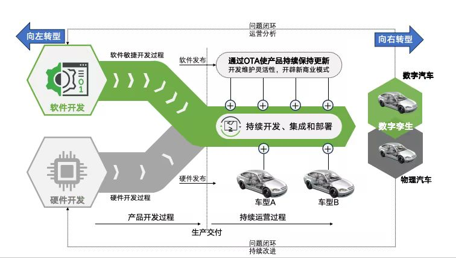
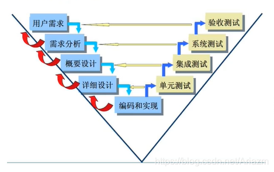
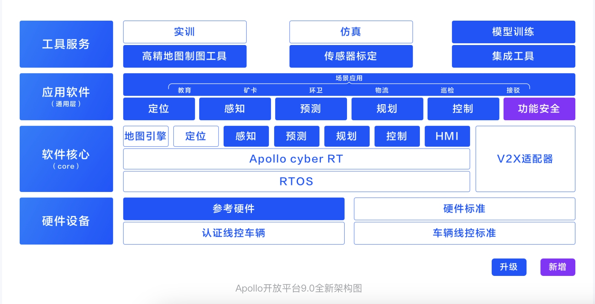

# 汽车项目软件开发流程与数据处理流程

---

## 一、汽车项目软件开发流程（核心框架）

### 1. 需求分析阶段
- **目标**：明确功能需求（如自动驾驶算法）、性能需求（响应时间≤20ms）、安全需求（ISO26262 ASIL等级）。  
- **输出物**：需求规格说明书、用户故事地图（含优先级）。  
- **工具**：DOORS（需求管理）、Axure（原型设计）。  
- **案例**：某车企智能座舱项目，通过用户访谈确定语音交互响应速度需≤0.5秒。  

### 2. 系统设计阶段
- **架构设计**：分层设计（感知层→决策层→执行层），明确模块接口（如CAN总线协议）。

- **数据流设计**：数据从传感器→ECU→云端的数据流向。  
- **工具**：SysML（系统建模）、Enterprise Architect,draw io(开源)
- **案例**：特斯拉Autopilot系统采用V模型开发，左侧需求→右侧验证。  

### 3. 编码与实现阶段
- **开发规范**：MISRA-C/C++代码规范（汽车行业强制标准）。  
- **模块开发**：  
  - 前端：Qt/HMI界面开发（如仪表盘显示）。  
  - 后端：ROS（机器人操作系统）实现算法逻辑。  
- **工具**：Git（版本控制）、Jenkins（CI/CD）。  
- **案例**：比亚迪K8s项目使用Python开发CAN总线控制模块。  

### 4. 测试验证阶段
- **单元测试**：验证单个函数（如故障码解析算法）。  
- **集成测试**：模块协同测试（如传感器数据融合）。  
- **系统测试**：实车路测（如自动驾驶场景覆盖）。  
- **工具**：googletest（单元测试）、CANoe（网络仿真）。  
- **案例**：某项目通过HIL台架测试发现ECU通信延迟问题。

### 5. 部署与维护阶段
- **OTA升级**：通过差分更新技术（如特斯拉OTA）部署新版本。  
- **数据监控**：Telemetry系统收集车辆运行数据。  
- **案例**：影子模式，或者是ota升级系统。  

---

## 二、汽车数据处理开发流程（技术侧重点）

### 1. 数据采集与清洗
- **数据源**：车载传感器（IMU、摄像头）、用户行为日志。  
- **清洗步骤**：  
  - 去噪：卡尔曼滤波处理传感器噪声。  
  - 异常值剔除：3σ原则过滤车速突变数据。  
- **工具**：Python（Pandas）、Apache Kafka（流处理）。  
- **案例**：某项目清洗10万条CAN日志，剔除15%无效数据。  
[一维卡尔曼滤波样例](../python/work_share/1d_kalman.py)

### 2. 特征工程与建模
- **特征提取**：时域特征（均值、方差）、频域特征（FFT分析）。  
- **模型开发**：  
  - 传统算法：随机森林预测电池健康度。  
  - 深度学习：LSTM预测车辆能耗。  
- **工具**：TensorFlow、PyTorch。  
- **案例**：某车企用XGBoost预测变速箱故障，准确率提升至92%。  

### 3. 数据可视化与报告
- **看板设计**：Grafana展示车辆运行状态（如SOC变化曲线）。  
- **自动化报告**：Python（Matplotlib）生成PDF/HTML报告。  
- **案例**：某物流公司通过数据看板优化车队油耗，成本降低18%。  

## 三、附录：术语解释
- **ASPICE**：汽车软件过程改进及能力评定标准。  
- **HIL测试**：硬件在环仿真测试。  
- **OTA**：空中下载技术。
- **IMU**:惯性测量单元（Inertial Measurement Unit）的缩写,用于测量物体的三个基本线性运动（加速度）和三个基本角运动（角速度)。
- **MISRA**:汽车工业软件可靠性联会(Motor Industry Software Reliability Association)，由汽车制造商、零部件供应商及工程咨询公司组成，其成员包括大部分欧美汽车生产商。