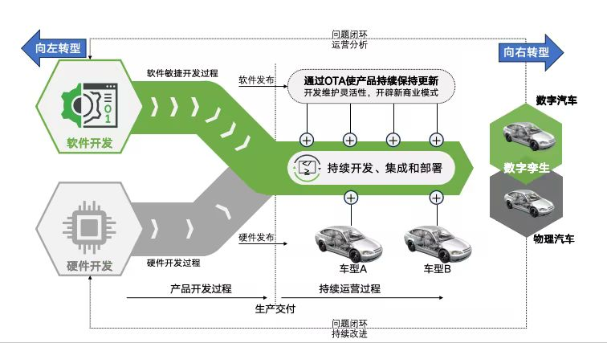
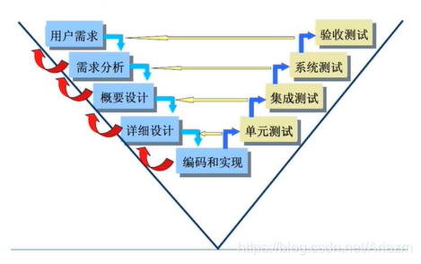
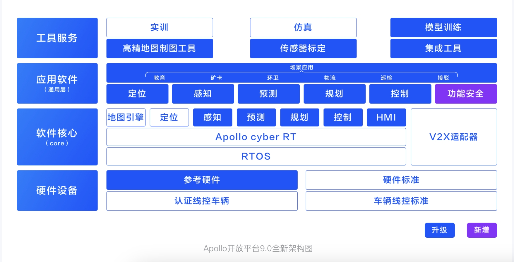

# 汽车项目软件开发流程与数据处理流程

---

## 一、汽车项目软件开发流程（核心框架）

### 1. 需求分析阶段
- **目标**：明确功能需求（如自动驾驶算法）、性能需求（响应时间≤20ms）、安全需求（ISO26262 ASIL等级）。  
- **输出物**：需求规格说明书、用户故事地图（含优先级）。  
- **工具**：DOORS（需求管理）、Axure（原型设计）。  
- **案例**：某车企智能座舱项目，通过用户访谈确定语音交互响应速度需≤0.5秒。  

### 2. 系统设计阶段
- **架构设计**：分层设计（感知层→决策层→执行层），明确模块接口（如CAN总线协议）。

- **数据流设计**：数据从传感器→ECU→云端的数据流向。  
- **工具**：SysML（系统建模）、Enterprise Architect,draw io(开源)
- **案例**：特斯拉Autopilot系统采用V模型开发，左侧需求→右侧验证。  

### 3. 编码与实现阶段
- **开发规范**：MISRA-C/C++代码规范（汽车行业强制标准）。  
- **模块开发**：  
  - 前端：Qt/HMI界面开发（如仪表盘显示）。  
  - 后端：ROS（机器人操作系统）实现算法逻辑。  
- **工具**：Git（版本控制）、Jenkins（CI/CD）。  
- **案例**：比亚迪K8s项目使用Python开发CAN总线控制模块。  

### 4. 测试验证阶段
- **单元测试**：验证单个函数（如故障码解析算法）。  
- **集成测试**：模块协同测试（如传感器数据融合）。  
- **系统测试**：实车路测（如自动驾驶场景覆盖）。  
- **工具**：googletest（单元测试）、CANoe（网络仿真）。  
- **案例**：某项目通过HIL台架测试发现ECU通信延迟问题。

### 5. 部署与维护阶段
- **OTA升级**：通过差分更新技术（如特斯拉OTA）部署新版本。  
- **数据监控**：Telemetry系统收集车辆运行数据。  
- **案例**：影子模式，或者是ota升级系统。  

---

## 二、汽车数据处理开发流程（技术侧重点）

### 1. 数据采集与清洗
- **数据源**：车载传感器（IMU、摄像头）、用户行为日志。  
- **清洗步骤**：  
  - 去噪：卡尔曼滤波处理传感器噪声。  
  - 异常值剔除：3σ原则过滤车速突变数据。  
- **工具**：Python（Pandas）、Apache Kafka（流处理）。  
- **案例**：某项目清洗10万条CAN日志，剔除15%无效数据。  
[一维卡尔曼滤波样例](../python/work_share/1d_kalman.py)

### 2. 特征工程与建模
- **特征提取**：时域特征（均值、方差）、频域特征（FFT分析）。  
- **模型开发**：  
  - 传统算法：随机森林预测电池健康度。  
  - 深度
- **工具**：TensorFlow、PyTorch。  
- **案例**：某车企用XGBoost预测变速箱故障，准确率提升至92%。  

### 3. 数据可视化与报告
- **看板设计**：Grafana展示车辆运行状态（如SOC变化曲线）。  
- **自动化报告**：Python（Matplotlib）生成PDF/HTML报告。  
- **案例**：某物流公司通过数据看板优化车队油耗，成本降低18%。  

## 三、附录：术语解释
- **ASPICE**：汽车软件过程改进及能力评定标准。  
- **HIL测试**：硬件在环仿真测试。  
- **OTA**：空中下载技术。
- **IMU**: 惯性测量单元（Inertial Measurement Unit）的缩写,用于测量物体的三个基本线性运动（加速度）和三个基本角运动（角速度)。
- **MISRA**: 汽车工业软件可靠性联会(Motor Industry Software Reliability Association)，由汽车制造商、零部件供应商及工程咨询公司组成，其成员包括大部分欧美汽车生产商。

## 四、ASPICE与V模型的比较

### 1. 共性 (Common Ground)
- **系统工程理念**:
  - 都强调系统性的软件开发方法。
  - 重视需求管理和追溯性。
  - 强调验证和确认(V&V)的重要性。
- **质量导向**:
  - 都以提高软件质量为核心目标。
  - 强调过程改进和持续优化。
  - 重视文档化和标准化。
- **阶段性开发**:
  - 都采用分阶段的开发方式。
  - 每个阶段都有明确的输入输出。
  - 强调阶段间的评审和确认。

### 2. 主要差异 (Key Differences)
- **性质定位**:
  - **V模型**: 开发生命周期模型，描述"做什么"。
  - **ASPICE**: 过程评估标准，规定"如何评价做得好不好"。
- **关注重点**:
  - **V模型**: 关注开发活动的逻辑顺序和测试对应关系。
  - **ASPICE**: 关注过程能力评估（0-5级）和持续改进。
- **应用场景**:
  - **V模型**: 用于指导项目开发流程。
  - **ASPICE**: 用于供应商评估、内部过程改进和客户审计。
- **评价维度**:
  - **V模型**: 评价项目进度和阶段完成度。
  - **ASPICE**: 评价过程属性（PA1.1到PA5.2）。

### 3. 实际应用中的关系
- **互补使用**:
  - V模型提供开发框架，ASPICE评估过程质量。
  - 两者结合使用效果更佳。
- **汽车行业实践**:
  - 项目层面采用V模型开发。
  - 组织层面通过ASPICE提升过程能力。
  - 通常要求ASPICE CL2/CL3认证。
- **成熟度演进**:
  - 从仅使用V模型，到V模型结合基础ASPICE要求。
  - 最终发展为完整的ASPICE体系与定制化V模型。

### 4. 选择建议
- **使用V模型当**:
  - 项目需要清晰的阶段划分。
  - 团队需理解开发与测试的对应关系。
  - 追求开发过程的逻辑性和系统性时。
- **关注ASPICE当**:
  - 需要进行供应商管理和评估。
  - 追求过程改进和组织成熟度。
  - 客户有明确的ASPICE等级要求。
  - 希望建立可持续的质量管理体系时。

> **总结**：两者并不冲突，在现代软件开发中往往是协同使用的关系。

## 五、ASPICE学习资料与文档

### 1. 官方标准与资源
- **核心标准**: ISO/IEC 33020, Automotive SPICE PAM v3.1.
- **官方资源**: VDA QMC工作组指南, Automotive SPICE Guidelines v3.1.

### 2. 推荐学习资料
- **入门级资料**: 学习ASPICE概述、过程能力等级、33个过程域、BP/WP清单；阅读《汽车SPICE实践指南》、《ASPICE过程改进实战》。
- **进阶学习材料**: 阅读ASPICE实施指南（覆盖CL1-5），参考博世、大陆、奥迪等公司的实施案例。

### 3. 在线学习与认证
- **培训机构**: intacs.info（官方）、SPICE User Group、国内汽车电子联盟等。
- **认证体系**: 评估师路径从基础级（Foundation）到主任评估师（Principal Assessor）。

### 4. 实用学习工具
- **评估工具**: SPICE 1-2-1自评估工具、Process Assessment Excel模板、ASPICE Gap Analysis差距分析工具。
- **文档模板**: 过程定义、工作产品、评估报告、改进计划等模板。

### 5. 学习路径建议
- **第一阶段 (1-2个月)**: 学习理论基础，理解ASPICE概念、过程域、能力等级和评估方法。
- **第二阶段 (2-3个月)**: 深入核心过程域，参与项目实践，使用评估工具和模板。
- **第三阶段 (3-6个月)**: 参加官方认证培训，学习行业案例，准备评估师认证。

### 6. 重点过程域学习优先级
- **核心工程过程域 (VDA Scope)**: SYS.2, SYS.3, SWE.1, SWE.2, SWE.3, SWE.4, SWE.5, SWE.6.
- **核心管理与支持过程域**: MAN.3, SUP.1, SUP.8, SUP.9, SUP.10.

### 7. SUP.10 变更请求管理详解
- **重要性**: 贯穿整个开发生命周期，是连接SYS/SWE、SUP.8、SUP.9和MAN.3等多个过程域的核心环节。
- **关键实践 (BP)**: 建立策略、识别记录、评估、批准、实施、跟踪关闭。
- **核心工作产品 (WP)**: 变更请求管理策略、变更记录、状态报告、影响分析、批准记录、实施跟踪记录。
- **风险**: 缺乏有效SUP.10会导致变更失控、连锁bug、追溯性丢失和项目成本超支。